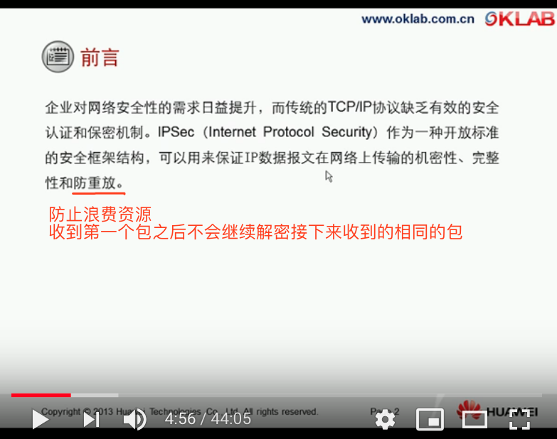
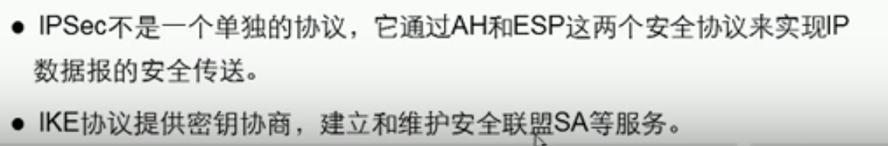
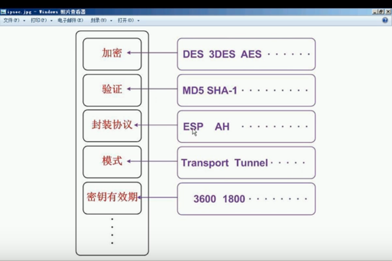
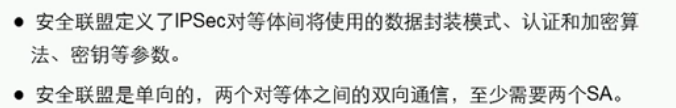
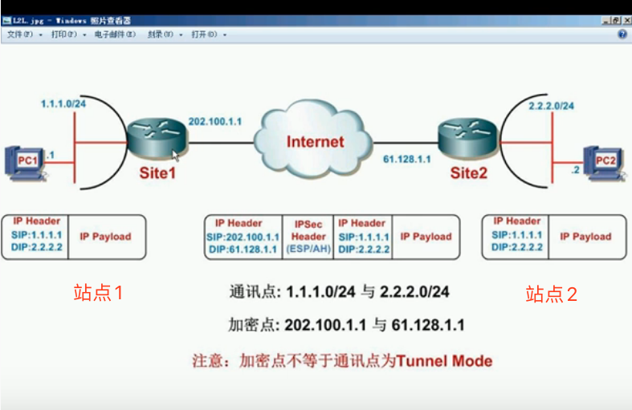

## Externalisation

### IaaS, PaaS,SaaS

## Décloisonnement

## Réseaux délégués

## VPN

Il permet les communications sur un réseau non-sûr

### IPSEC

只能保护ip流量

* 会加密或者验证paquets chiffre et/ou authentifier des paquets

* VPN SSL

  sur TLS (comme HTTP)

  passe plus vite

* 实现了站点和站点的互联以及远程登录

  

  

#### AH/ESP 

 	封装协议，一般用ESP

#### IKE

​	提供密钥协商

​	协商的内容如下（这些内容就是SA）	

#### 传输模式&隧道模式

实现站点到站点之间的传输需要使用隧道模式

由于传输模式不更改ip头部，头部的ip地址是公司私有网络，Internet网络无法识别

## Crypthographe

### Chiffrement symétrique

一方通过密钥将信息加密后，把密文传给另一方，另一方通过这个***<u>相同的密钥</u>*** 将密文解密，转换成可以理解的明文

缺点：只要其中一个人密钥被盗窃了，那么整体加密的信息将都被破解了

### Chiffrement asymétrique

chiffre des messages claires par la clé publique et déchiffre par la clé privée

缺点：网警可以冒充张三发送给李四“网警的公钥”，而不是“张三的公钥”，那么当李四收到该公钥的时候，以为是张三的公钥就不假思索的使用该公钥加密了他的信息，然后毫不犹豫的将加密的密文发了过去，然后网警得意的笑了。

# VRRP

三个候选人必须存在在同一个VLAN（广播域）中，但是只