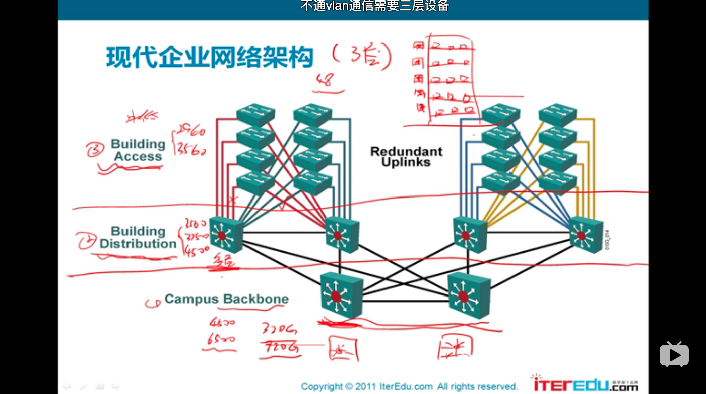
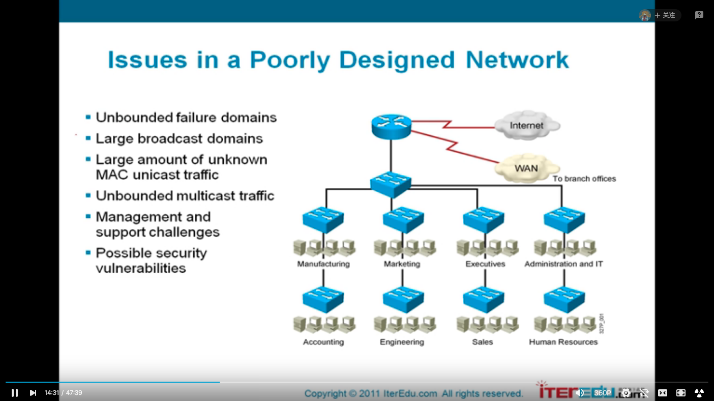
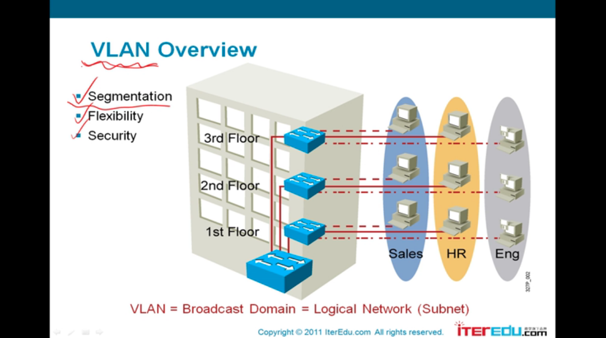
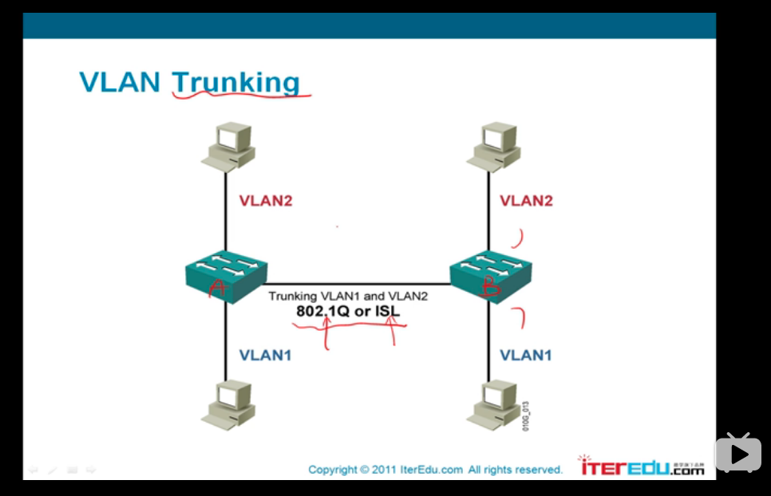
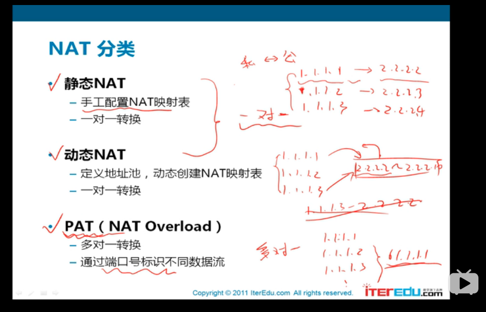
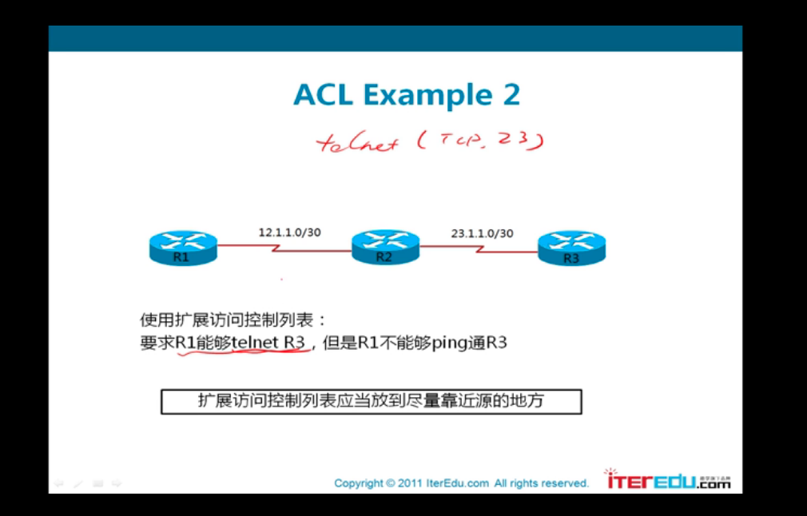

# 以太网二层

## Mode de fonctionnement

table de MAC


## Spanning-tree STP

pour empêcher des bouclage

### 好处：

* 会计算最佳路径
* 根据系统优先级配置
* 安全链路，因为提供了冗余链路

### 坏处：

* convergence 慢
* 如果新加一个点，就要重新计算

## Aggrégation 802.3ad LACP

服务器和相同switch牌子的集群之间，将多个网络链路合并成一个


现代企业网络架构

# 

traffic —— 流量

# VLAN



交换机可以隔离冲突域但是不能隔离广播域

路由器可以隔离广播域

泛洪：除了从接受接口的其他接口，把数据包转发出去

交换机有一个学习的过程，每个接口对应的是哪些MAC地址，每次开机都要学习一遍

会有广播风暴



VLAN可以对交换机上对接口进行逻辑的划分，

正常情况下，交换机上的所有接口是处在同一个子网下的

但是用了VLAN之后就可以分成多个子网——这是一个基于交换机2层的子网

## Encapsulation 802.1q

为了实现在一个接口上去承载多个VLAN流量的时候，使用VLAN Trunking技术




两个协议 802.1Q会修改帧，另一个不会

## VLAN natif

当收到一个没有标记配置端口号的trame的时候


### eg:


E发送trame给F，经过trunk但是没有任何的VLAN tag

## Private VLAN

相同VLAN下的机器无法互相沟通

# Routage

## IPv4

## Configuration Roas

## VRF???

## VRRP

pour partager une IP virtuelle

# Protection à l'accès

基于MAC地址的访问保护有一个很大的问题就是-> usurpable(可篡位的)

## 802.1x

在2层使用更多的critères来过滤访问

使用AAA

# NAT

faire correspondre une seule adresse externe publique visible sur Internet à toutes les adresses d'un réseau privé

实现内网全部使用私有地址，它能够把一个私有地址转换成一个公有地址

网络合并的时候解决地址冲突



## 配置NAT

### 指定NAT转换方向


# ACL

## 配置ACL

### 标准访问控制列表

标准访问控制列表应当放到尽量靠近目标的地方

在标准访问控制列表中默认隐含拒绝所有

```shell
access-list 1 permit any
```

#### 在某个接口删除一个ACL

```shell
no access-list 1
```


### 扩展访问控制列表



要尽早地把流量过滤掉，可以节省网络带宽

不能够ping —— 使用icmp 