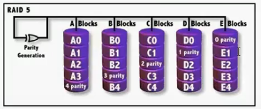
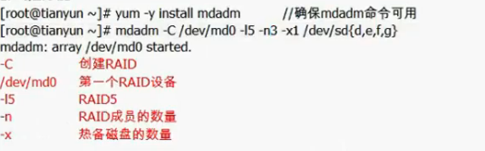
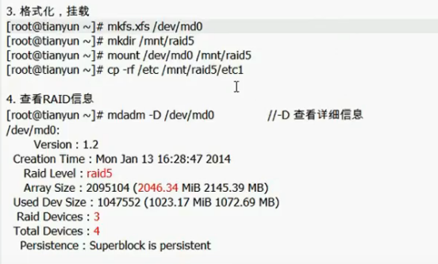
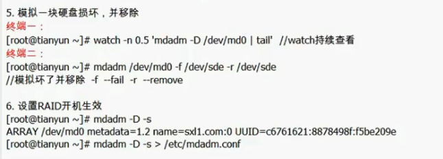
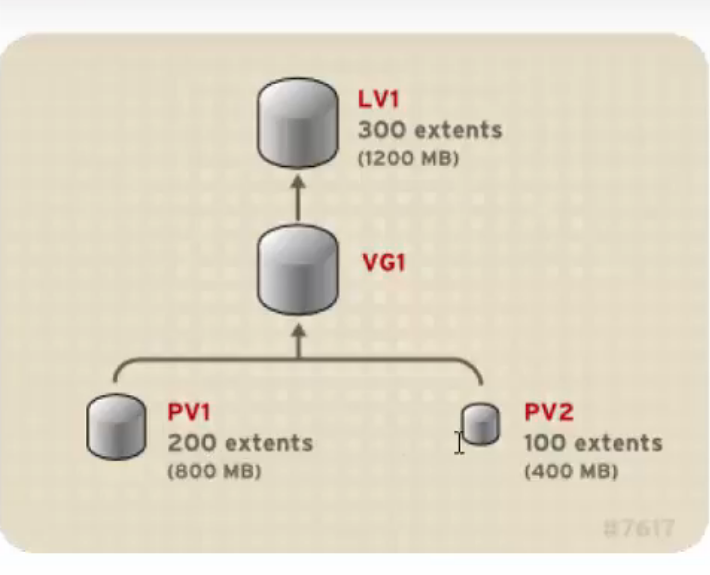
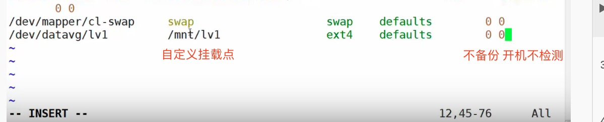
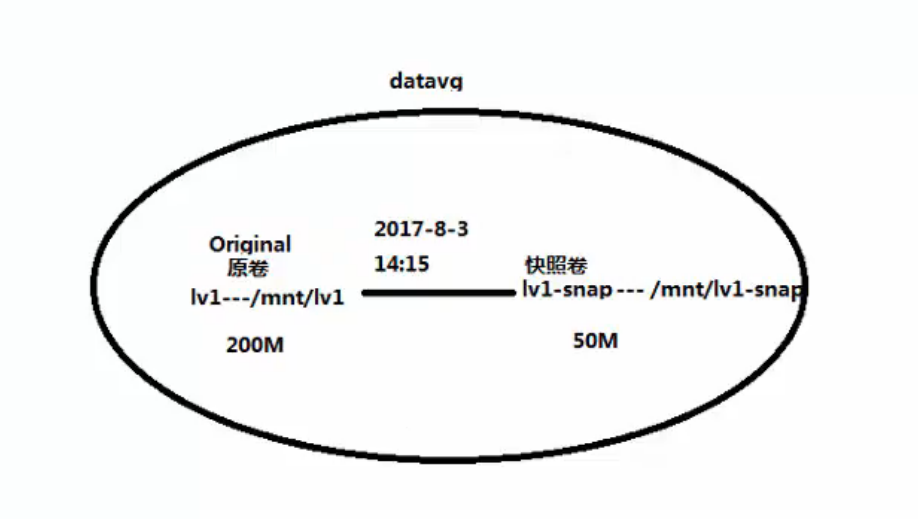
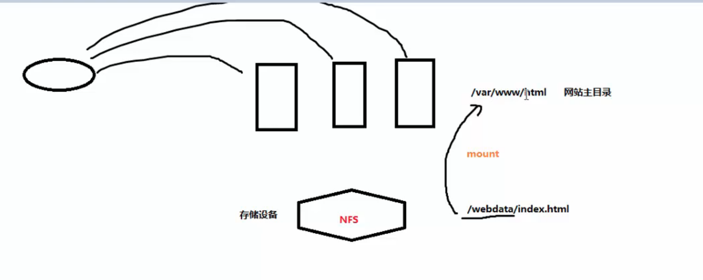

# RAID


* RAID0：数据写入的时候往ABCD里面同时写，所以IO速度很快

* RAID1：把相同的数据同时写进两个盘里

* RAID5：横向的是一个chunk，每一个chunk中有一个校验盘

  ​			   坏了一个，速度就慢下来了



## 创建RAID

### RAID5







```shell
ssh-keygen
ssh-copy-id <@ip>
```


# LVM

## 基本分区（MBR|GPT)

* mount 挂载 把一个存储设备和一个文件夹关联起来

* 扩容步骤

  1. 分区
  2. 格式化 -> 选择合适的文件系统
  3. mount 挂载时使用UUID

这种分区的问题在于，容量在最开始的时候定死了

## LVM 逻辑卷

优势：在线扩容（不用卸载），在线数据迁移

### PV

PV可以是有RAID组成的也可以是物理磁盘，

一般做逻辑卷之前做RAID

### PG

是有PV构成的卷组

### LV

是在PG中分出一个或多个逻辑卷

### PE（物理扩展）

是组成PV的很多个小格子

### LE（逻辑扩展）

逻辑扩展是映射到物理扩展上的

ex：

如果LV只有200个LE，那么其中的100个可以是PV1中的PE，另外100个是PV2中的PE

### 逻辑卷如何扩展（扩LV）

1. 看VG中有没有剩余空间
   * 如果有 -> 直接扩
   * 如果没有 -> 增加新的PV到VG中

创建VG时需要指定PE

```shell
-s 8M
```

## 创建LVM

```shell
pvs
pvscan
pvdisplay #三种方法查看PV, PG, LV状态
```

### PV

```shell
pvcreate /dev/vda #把整块vda盘做成PV 默认的PE是4M
```

### PV

```shell
vgcreate datavg /dev/vda #创建名叫datavg的PV，并把vda这个PV加进去
```

### LV

```shell
lvcreate -L 100M -n lv1 datavg #-L指定LV的大小 -n LV的名字
```

### 格式化LV

```shell
mkfs.ext4 /dev/datavg/lv1
mkfs.xfs /dev/datavg/lv2
```

### 挂载

数据在哪，我们就挂哪

```shell
mkdir /mnt/lv1
mkdir /mnt/lv2
vim /etc/fstab
```



```shell
mount -a
```

### 其他操作

```shell
vgextend datavg /dev/vde #加入新的vg

#####替换pv
#1. 先把老pv中的数据转移
pvmove <olddev> <destination>
#2. 把老pv删除
vgreduce datavg <olddev>

#####lv扩容
#1. lv放大
lvextend -L 200M /dev/datavg/lv1 #扩容到200M
#2. 扩文件系统
df -Th #查看格式化格式
xfs_growfs /dev/vg1/lv1 # xfs
resize2fs /dev/vg1/lv2 # ext2/3/4
```

## 逻辑卷快照snapshot

快照卷也是LV中的一个

```shell
lvcreate -L 50M -n lv1-snap -s /dev/datavg/lv1 #-s -> snapshot
mkdir /mnt/lv1-snap
mount -o ro /dev/datavg/lv1-snap /mnt/lv1-snap #初衷是不希望破坏快照卷中的数据
#我们只给快照卷50M的大小，但是挂载之后发现，快照卷的大小和lv1的大小一样
#快照只是拷贝了原数据中改变的部分，所以如果原数据完全改变以至于超过了快照的大小，这时候快照卷就没有用了
#所以快照卷的目的是为了数据备份的一致性问题
#备份的时候，业务在不断推进，原始数据在变
```



做备份保证数据一致性：

1. 全局读锁
2. lvm snaphost -> 写script，保留开始备份那一刻时的快照
3. 释放锁
4. mount -o snapshot
5. 从snapshot卷中复制数据
6. 卸载snapshot
7. lvremove -f snapshot

# NFS

三台网页服务器有一个主目录，要求访问三个服务器显示的主页内容是一样的，这个时候我们可以把主目录放在一个存储设备中，采用mount，把存储设备mount到每个服务器的网站主目录上



# iSCSI

可以同时解决存储空间问题，又能分担服务器压力

# MariaDB

一个MySQL分支下的数据库