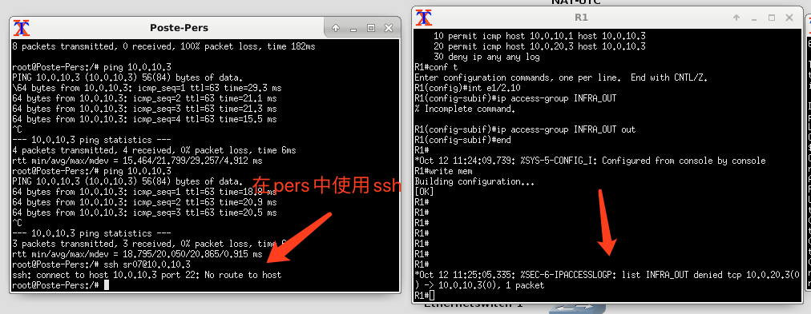

* NAT —— 网络地址转换在计算机网络中是一种在IP数据包通过路由器或防火墙时重写来源IP地址或目的IP地址的技术。这种技术被普遍使用在有多台主机但只通过一个公有IP地址访问因特网的私有网络中。
* fastethernet —— 速度很快的以太网
* commande in host for setting @ip

```shell
ip address add @ip+mask dev eth0 #have to set mask
ip route add default via <@ip_route>
```

* commande in router

  ```shell
  sh run int <int_num> #watch info of an interface
  ```


# ACL

1. 先检查两台主机之间是否能正常互联
2. 在路由器上配置access-list étendu
3. 给相应的接口配上


## Exercice 7: Filtrage par ACL 

* [x] Sur le conteneur Serveur-Infra, démarrer le service sshd : 

```shell
/etc/init.d/ssh restart
```

* [x]  Vérifier le bon fonctionnement du service en local : 

```shell
netstat -laputen  
#Active Internet connections (servers and established)  
Proto Recv-Q Send-Q Local Address 
Foreign Address Inode PID/Program name  
tcp 0 0 0.0.0.0:22 0.0.0.0:* LISTEN State User 0 36652 - 
ssh sr07@localhost
#sr07@localhost's password: ← entrer 
sr07sr07 $ exit							
```
* [x] Vérifier ensuite l’accès au conteneur debian-sr07-1 depuis le conteneur debian-sr07- 2: 

* [x] Sur le routeur, créer une access-list étendue d’identifiant INFRA_OUT qui permettra le ping depuis le routeur vers le conteneur debian-sr07-1 uniquement : 

* [x] Appliquer ensuite cette access-list sur le traffic sortant de l’interface e1/2.10 : 

```shell
ssh sr07@10.0.10.3
#sr07@localhost's password: ← entrer 
sr07sr07 $ exit
```
```shell
R# conf t
R(config)# ip access-list extended INFRA_OUT R(config-ext-nacl)# permit icmp host 10.0.10.1 host 10.0.10.3 R(config-ext-nacl)# end
R# sh ip access-lists INFRA_OUT
Extended IP access-list INFRA_OUT 
10 permit icmp host 10.0.10.1 host 10.0.10.3 

R# conf t
R(config)# int e1/2.10
R(config-if)# ip access-group INFRA_OUT out R(config-if)# end
R# write mem 
```

* [ ] Tester le ping depuis le conteneur debian-sr07-2. 

* [ ] Ajouter à cette même access-list , la permission de pinguer depuis le conteneur debian-sr07-2 vers le conteneur debian-sr07-1 : 
```shell
R# conf t  
R(config)# ip access-list extended INFRA_OUT 
R(config-ext-nacl)# permit ..... 
R(config-ext-nacl)# deny ip any any log 
R(config-ext-nacl)# end  
R# sh ip access-lists INFRA_OUT 				
10 permit icmp host 10.0.10.1 host 10.0.10.3 
20 permit .... 
30 deny ip any any log   
```


* [x] Que peut on voir sur la console du routeur lorsque le conteneur debian-sr07-2 tente un ssh sur le conteneur debian-sr07-1? 



Parce qu'on seulement permet la porte de`ping` (protocole icmp) donc la porte 22 (ssh) est interdit.

* [x] Dans cette même access-list 100, défiltrer en plus des défiltrages icmp précédents uniquement le traffic ssh (tcp port 22) en provenance du conteneur `debian-sr07-2` vers de conteneur `debian-sr07-1`. 

  ```shell
  permit tcp host @ip_source host @ip_dest eq 22
  ```

  

  


* [x] Depuis le conteneur `debian-sr07-1` , tester les commandes : 
```shell
export http_proxy=”http://proxyweb.utc.fr:3128”
export https_proxy=”https://proxyweb.utc.fr:3128” 
apt-get install locate 
```
* [x] Analyser l’erreur de la dernière commande et le résultat sur la console du routeur. Expliqueur pourquoi elle ne fonctionne pas. 

  
  
  All the other services have been denied by ACL.
  
  `Failure resolving 'proxyweb.utc.fr'` -> DNS has been denied

### Access-lists réflexives

**La solution , les access-lists réflexives.** 

* [x] Créer une access list `INFRA_IN` que nous allons appliquer au traffic entrée de l’interface `e1/2.10` (c’est à dire pour le traffic en provenance du conteneur debian- sr07-1 vers le routeur ou l’extérieur). 


```shell
R# conf t  
R(config)# ip access-list extended INFRA_IN  
R(config-ext-nacl)# permit udp host 10.0.10.2 host 195.85.155.55 eq 53 reflect DNSREQ 
R(config-ext-nacl)# deny ip any any log 
R(config-ext-nacl)# exit  
R(config)# int e1/2.10  
R(config-if)# ip access-group INFRA_IN in 
R(config-if)# exit 								
R(config)# ip access-list extended INFRA_OUT 
R(config-ext-nacl)# 24 evaluate DNSREQ  
R# write mem 
R# show access-lists
```


* [x] Que donne le résultat de la commande “apt-get install locate” ? 

  

* [ ] Ajouter une entrée réflexive l’autorisation de debian-sr07-1 vers `195.83.155.55` sur le port `3128` en tcp et l’évaluation correspondante. 

  ```shell
  R# conf t  
  R(config)# ip access-list extended INFRA_IN  
  R(config-ext-nacl)# permit tcp host 10.0.10.2 host 195.85.155.55 eq 3128 reflect DNSREQ 
  R(config-ext-nacl)# deny ip any any log 
  R(config-ext-nacl)# exit  
  R(config)# int e1/2.10  
  R(config-if)# ip access-group INFRA_IN in 
  R(config-if)# exit 								
  R(config)# ip access-list extended INFRA_OUT 
  R(config-ext-nacl)# 24 evaluate DNSREQ  
  R# write mem 
  R# show access-lists
  ```

  

La commande `apt-get install locate` doit aboutir. 

* [ ] Sur le conteneur `debian-sr07-1` , relancer le renouvellement du bail DHCP avec la commande :
`dhclient -v`

* [ ] Vérifier la console du routeur? A quel niveau peut on voir un bloquage? Quel protocole est bloqué? 

* [ ] Ajouter une règle permettant de débloquer les reqêtes DHCP sur la bonne access- list. 
## Exercice 8 : 
* [ ] Aggrégation de lien LACP (802.3ad)
* [ ] Ajouter un routeur R2 de même type que R1 :
* [ ] Interconnecté le avec R1 en respectant les 2 liens : 
`f2/0 ↔ f2/0 et f2/1 ↔ f2/1 `

* [ ] Sur le router R1, configurer un port-channel regroupant les 2 interfaces f2/0 et f2/1 
```shell
R1# conf t
 R1(config)# interface Port-Channel 1 R1(config)# exit
 R1(config)# interface FastEthernet2/0 R1(config)# channel-group 1 R1(config)# interface FastEthernet2/1 R1(config)# channel-group 1 R1(config)# end 
```

* [ ] Vérifier l’état du Port-Channel : 

* [ ] Faire la même configuration sur le routeur R2.
* [ ] Analyser l’état du Port-Channel.
* [ ] Affecter des adresses IP aux routeurs pour l’interconnexion : 

@IP pour Po1 sur R1 = 10.0.99.1/24 @IP pour Po1 sur R2 = 10.0.99.2/24 

* [ ] Depuis le routeur R2, exécuter un ping vers le routeur R1. 

  ```shell
  R1# sh interface Port-Channel 1 .....
   N° of active members..... 
   Member 0 : FastEthernet2/0 Member 1 : FastEthernet2/1 
  ```

## Exercice 9 : 
* [ ] Configuration d’un site distant
* [ ] Connecter un switch Ethernet au routeur R2 sur l’interface FastEthernet0/0 

### a. Vlans : 

Sur le site distant, 3 vlans seront créés : 

\- Vlan LABO : id 30
\- Vlan ETU : id 40
 \- Vlan INFRA_DIST : id 50 

* [ ] Configurer les ports du switch de la manière suivante : 

* [ ] Ajouter 2 conteneurs de type debian-sr07 à chaque vlan : vlan LABO : 

\- Serveur-Labo : adresse MAC = 2e:00:00:00:30:03 

\- Client-Labo : adresse MAC = 2e:00:00:00:30:04 vlan ETU : 

\- Serveur-Etu : adresse MAC = 2e:00:00:00:40:03 

\- Client-Etu : adresse MAC = 2e:00:00:00:40:04 vlan INFRA_DIST : 

\- Serveur-Infra-Dist : adresse MAC = 2e:00:00:00:50:03 

* [ ] Pour chaque conteneur, éditer la configuration : clic droit → configure → network Configuration → edit 

* [ ] Ajouter les lignes : 

* [ ] Pour le conteneur Serveur-Infra-Dist , éditer la configuration : clic droit → configure → network Configuration → edit 

auto eth0
 iface eth0 inet dhcp 

hwaddress ether 2e:00:00:00:xx:xx 

auto eth0
 iface eth0 inet static 

hwaddress ether 2e:00:00:00:50:03 ip address 10.0.50.3
 netmask 255.255.255.0
 gateway 10.0.50.1 

up echo “nameserver” 195.83.155.55 > /etc/resolv.conf 

* [ ] Créer les interfaces vlans sur le routeur R2 et suivre l’adressage suivant : 

@ip sur Fa0/0.30 = 10.0.30.1/24 @ip sur Fa0/0.40 = 10.0.40.1/24 @ip sur Fa0/0.50 = 10.0.50.1/24 
* [ ] Pinguer le Routeur R2 sur `10.0.50.1`. 

* [ ] Pinguer le Routeur R1 sur `10.0.99.1`.
 => Si cela ne fonctionne pas, , résoudre les problèmes de route sur la source et la destination : 

\- sur R2 : 

\# ip route 0.0.0.0 0.0.0.0 10.0.99.1 

\- sur R1 : 

\# ip route 10.0.50.0 255.255.255.0 10.0.99.2 

\- sur R1 : 

### b. DHCP : 

* [ ] Repérer les adresses MAC des 2 Serveurs et 2 Clients. 

* [ ] Sur le Serveur-Infra-Dist, configurer un serveur DHCP (isc-dhcp-server) de manière à offrir des adresses au vlan ETU et LABO. 

* [ ] Les fichiers à modifier sont les suivants : /etc/dhcp/dhcpd.conf : 

| # int Po1  (config-if)# ip nat inside |
| ------------------------------------- |
|                                       |

| subnet 10.0.50.0 ... { } 								subnet 10.0.30.0 ... { options routers .....; 								options dns-name-servers 195.83.155.55; } 								subnet 10.0.40.0 ... { options routers .....; 								options dns-name-servers 195.83.155.55; } 								host Serveur-Labo {  hardware ethernet xx:xx:xx:xx:xx:xx; 							 						 							← adresse repérée avec la |
| ------------------------------------------------------------ |
| commande ip link fixed-address 10.0.30.3; 								} 								host Client-Labo {  hardware ethernet xx:xx:xx:xx:xx:xx; 								commande ip link fixed-address 10.0.30.4; 							 						 							← adresse repérée avec la 

} 

host Serveur-Etu {
 hardware ethernet xx:xx:xx:xx:xx:xx; 

commande ip link fixed-address 10.0.40.3; 

} 

host Client-Etu {
 hardware ethernet xx:xx:xx:xx:xx:xx; 

commande ip link fixed-address 10.0.40.4; 

} 

← adresse repérée avec la 

← adresse repérée avec la 

et le fichier /etc/default/isc-dhcp-server 

INTERFACES=”eth0” 

* [ ] Le service sera démarré à l’aide de la commande `service isc-dhcp-server restart`. 
* [ ] Le routeur R2 sera configuré de manière à relayer les requêtes DHCP vers le serveur Serveur_Infra_Dist. 
* [ ] Valider la délivrance d’adresses par le serveur DHCP en analysant le fichier `/var/log/syslog`. 
* [ ] Les 2 clients doivent pouvoir pinguer les 2 serveurs. 
* [ ] Dans le fichier `/etc/apache2/sites-enabled/000-default.conf` de chaque serveur, configurer un ServerName avec le nom du serveur correspondant. 
* [ ] Démarrer ensuite apache2 avec la commande “/etc/init.d/apache2 start”.
   Le client du même vlan doit être capable de lancer la commande :”wget 10.0.xx.3” 
* [ ] vers le serveur du même vlan. 

### c. Access-lists 

* [ ] Sur le routeur R2, sur chacune des interfaces Fa0.0.30 , Fa0/0.40 et Fa0/0.50, configurer une access-lists en entrée et une access-list en sortie de manière a ce que : 

```shell
R2# conf t
R2(config) #int Fa0/0.30
R2(config) #ip helper-address 10.0.50.3 R2(config) #int Fa0/0.40
R2(config) #ip helper-address 10.0.50.3 R2(config)# end
R2# write mem 
```


 \- Les 2 clients et les 2 serveurs obtiennent des adresses IP du serveur Serveur-Infra

Dist
 \- Seul Client-Labo puisse consulter le site internet du Serveur-Labo
 \- Client-Labo puisse consulter le site de Serveur-Etuet de Serveur-Labo. 