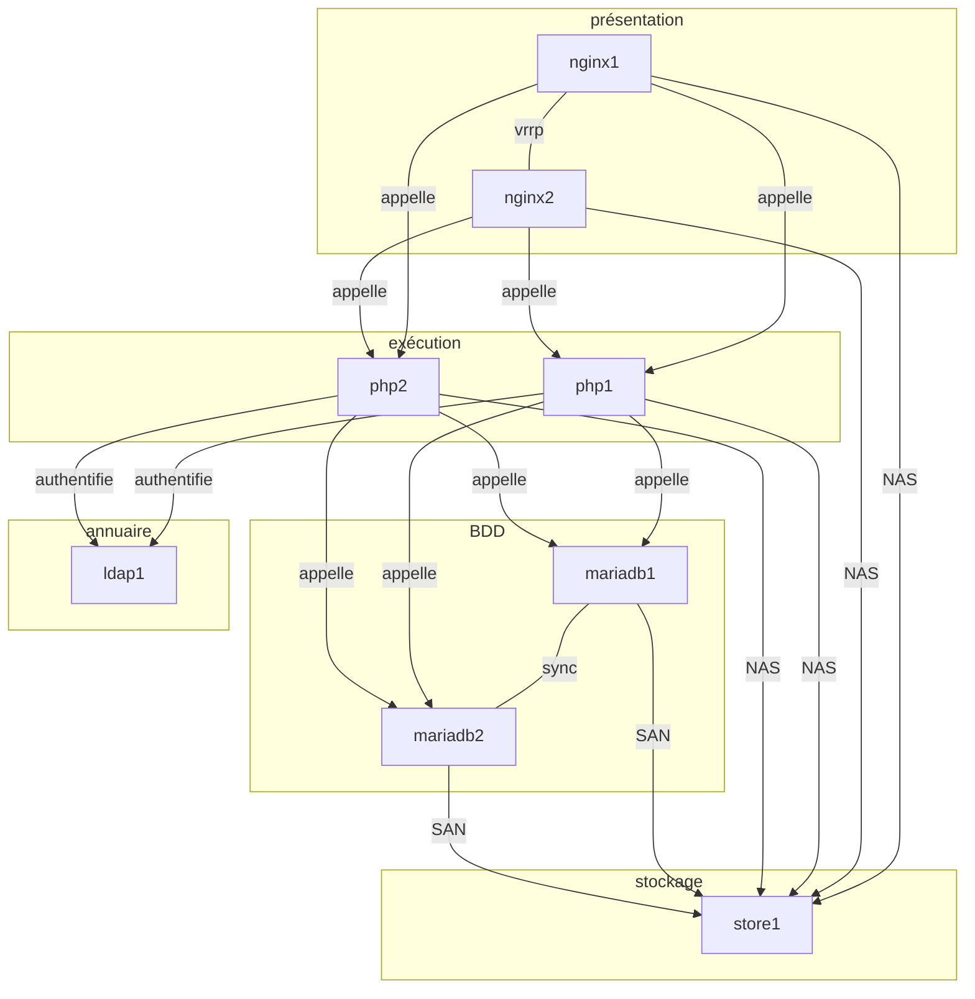
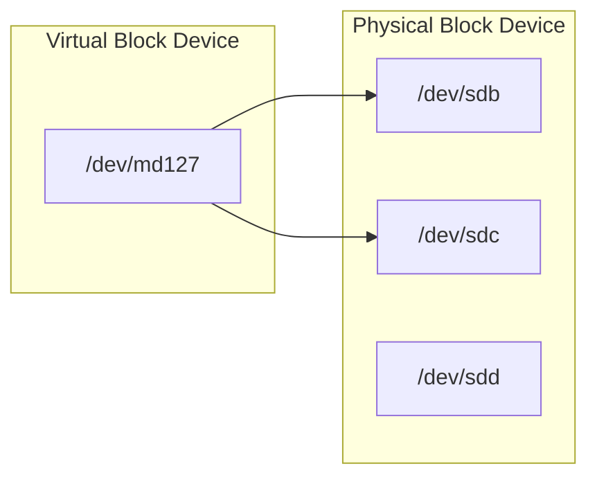

# Objectif général du projet

L’objectif général du projet est de mettre en place NextCloud, une application Web de stockage et de partage de données, dans un mode le plus redondant possible. Pour cela, nous allons construire :

* un stockage redondant qui assurera à la fois la fonction de NAS (via NFS) et la fonction de SAN (via iSCSI)
* deux serveurs MariaDB en cluster, assurant redondance des données et de leur accès
* deux serveurs d’exécution PHP-FPM, pour la partie applicative
* deux serveurs de présentation NginX, pour la partie présentation, avec une adresse virtuelle VRRP pour la redondance frontale



> On ne s’inquiète pas, ça va bien se passer :)

## Systèmes redondants de données: RAID

Objectif de cette partie :



### Création d’un RAID1 logiciel

> Vous pouvez vérifier les partitions/disques à votre disposition avec la commande `lsblk`


* [x]  Construire un block device virtuel

  Vous allez créer un array en RAID1 à partir de deux disques virtuelles. À partir des deux block devices physiques disponibles (`/dev/sdb` et `/dev/sdc`), vous allez pouvoir construire un block device virtuel grâce à la commande `mdadm` (`/dev/md127` dans notre cas) :

```
# mdadm --create /dev/md127 --level=1 --raid-devices=2 /dev/sdb /dev/sdc
```

​	`--level` permet de spécifier le type de RAID que vous souhaitez (0, 1, 5, 10, etc…).

 `--raid-devices` précise le nombre de partitions ou block devices physiques concernés par ce RAID. L’ordre dans lequel vous listez les partitions va déterminer quelle partition sera considérée comme maître.

Vous pouvez constater la progression de la construction (ou de la reconstruction) du RAID via le fichier `/proc/mdstat`.

```bash
# cat /proc/mdstat
Personalities : [raid1]
md127 : active raid1 sdc[1] sdb[0]
      38981632 blocks [2/2] [UU]
unused devices: <none>
```
## Gestionnaire de volumes logiques : LVM

### Création d’un Volume Group

* [x] Démontez `/dev/md127` de votre arborescence.

  ```shell
  sudo umount /dev/md127
  ```

* [x] Créez un Physical Volume sur ce le dernier disque de la machine :

```
# pvcreate /dev/sdd
```

* [x] Le volume physique est à présent initialisé correctement. Créez un groupe de volumes :

```
# vgcreate vgsr06a0xx /dev/sdd
```

Le VG est à présent prêt pour recevoir des volumes logiques. Contrôlez le nombre de physical extents disponibles dans votre VG :

```bash
# vgdisplay
  --- Volume group ---
  VG Name               vgsr06a0xx
  System ID
  Format                lvm2
  [...]
  VG Size               672,00MB
  PE Size               32,00 MB
  Total PE              21
  Alloc PE / Size       0 / 0,00 MB
  Free  PE / Size       21 / 672,00 MB
  VG UUID               Dngwte-RuVl-CdqX-fEAG-2YE9-BdiS-EE12x6
```

* [x] Créez en conséquence un LV :

```bash
lvcreate --size 2G --name lvnfs vgsr07tp1
```

Créez un système de fichiers dans ce LV et montez-le dans votre arborescence (dans `/mnt` par exemple).

```shell
sudo mkfs.ext4 /dev/vgsr07tp1/lvmariadb1
sudo mkfs.ext4 /dev/vgsr07tp1/lvmariadb2
#sudo mkdir /mnt/lvm
#sudo mount /dev/vgsr07tp1/lvtest /mnt/lvm
```

> Quel est le type du fichier /dev/<volume_group>/<logical_volume> ?


symbolic link

## Configuration iSCSI

Nous allons maintenant configurer une target iSCSI sur notre serveur de stockage et le tester.

* [x] Commencez par installer `tgt` :

```bash
apt install tgt
```

### Configuration des volumes et de la target (store1)

* [x] Créez deux logical volumes LVM sur votre VG, d’environ 2Gio chacun. Notez qu’il ne faut pas les formater.

  `lvmariadb1`

  `lvmariadb2`

* [x] Créez deux fichiers de configuration sous `/etc/tgt/conf.d` terminant en `.conf` et ressemblant à ceci (à adapter à votre cas) :

```
<target iqn.2018-10.sr06a0xx.utc:tg1-lv1> 
# ceci est le World Wide Name de la target
	backing-store /dev/vgsr60a0xx/iscsi_lv1# ceci est le block device que vous partagez en SAN
	incominguser store1 SuperMotDePasse # ceci est le nom d’utilisateur/mot de passe pour identifier le client
</target>
```


* [x] Redémarrez `tgt` pour prendre en compte les changements :

```bash
systemctl restart tgt.service
sudo service tgt start
```

* [x] Vous pouvez voir l’état de `tgt` avec la commande suivante :

```
# tgtadm --mode target --op show
```

Vous devriez voir vos deux volumes exportés en SAN.


### Test de configuration d’un client(mariadb)

* [x] Sur la machine de test, installez `open-iscsi` :

```
# apt install open-iscsi
```

* [x] Vous devez ensuite découvrir la target et vous connectez dessus. Pour cela :

```bash
sudo iscsiadm -m discovery -t st -p 172.16.210.135
#<adresse IP de la target> 
<adresse IP de la target>:3260,1 iqn.2018-09.sr06a0xx.utc:tg1-lv1
<adresse IP de la target>:3260,1 iqn.2018-09.sr06a0xx.utc:tg1-lv2
```


* [x] Cette découverte va automatiquement créer des fichiers de configuration dans `/etc/iscsi/send_targets`. Trouvez le fichier `default` correspondant à votre première `LUN iSCSI` sur votre target et remplacez les lignes :

  ```bash
  sudo vim /etc/iscsi/nodes/iqn.2019-10.sr07tp1.utc:tgl-lvmariadb1/172.16.210.135,3260,1/default
  ```

```
node.startup = manual
[…]
node.session.auth.authmethod = None
```

Par :

```
node.startup = automatic
node.session.auth.authmethod = CHAP
```

* [x] Ajoutez ensuite les lignes correspondants au login/pass défini plus haut :

```
node.session.auth.username = store1
node.session.auth.password = sr07tp1
```

```bash
service open-iscsi restart   (For sysv init systems)
```

* [x] Vous pouvez alors vous loggez sur la LUN de la target via la commande suivante :

```bash
# iscsiadm -m node --targetname iqn.2018-09.sr06a0xx.utc:tg1-lv1 -l

sudo iscsiadm -m node --targetname iqn.2019-10.sr07tp1.utc:tgl-lvmariadb1 -l
```

Logiquement, vous devriez voir apparaître un nouveau disque `/dev/sdb` si vous utilisez la commande `lsblk`.


* [x] Vous pouvez le formater en `ext4` ou autres et le monter dans `/srv` (inutile de créer une partition dessus). 

  ```bash
  sudo mkfs.ext4 /dev/sdb
  sudo mount /dev/sdb /var/lib/mysql
  ```

Remarquez bien que vous avez créé ce système de fichiers **côté initiator** (client) et que le target (serveur) n’a donc absolument aucune idée de ce que vous êtes en train de faire.

* [x] Éditez le fichier `/etc/fstab` pour rendre le changement persistent au démarrage et redémarrez pour vérifier (supprimez votre point de montage NFS au passage) :

```
/dev/sdb	/var/lib/mysql	ext4	defaults,auto,_netdev	0	0
```

Si tout fonctionne correctement, vous pouvez supprimer complètement cette machine de test. Lors de l’installation de NextCloud, les machines frontales (présentation avec NginX et exécution avec PHP-FPM) auront besoin d’accéder au NAS héberger sur la machine de stockage. Les deux machines virtuelles constituant le cluster de base de données accèderont chacune à une LUN exporté en mode SAN par cette même machine.

# Cluster MariaDB

* [x] Clonez deux machines supplémentaires. 

* [x] Modifiez leur paramétrage correctement. Formatez et montez un volume iSCSI distant sur chaque machine dans `/var/lib/mysql`.

  先挂载再安装！！！！！
  
  ```bash
  sudo mount /dev/sdb /var/lib/mysql
  ```

## Installation de MariaDB et paramétrage de Galera Cluster

* [x] Activez les dépôts `universe` sur la machine en ajoutant le mot clé correspondant dans `/etc/apt/sources.list` (juste après le mot-clé `main`). 

  ```bash
  sudo add-apt-repository universe
  
  ######For uninstalling mariadb
  sudo apt-get remove mariadb*
  dpkg -l |grep ^rc|awk '{print $2}' |sudo xargs dpkg -P
  sudo apt-get autoremove --purge mariadb-client-10.1
  sudo umount /dev/sdb
  sudo rm -rf /var/lib/mysql
  df -T
  sudo mkdir /var/lib/mysql
  sudo mkfs.ext4 /dev/sdb
  sudo mount /dev/sdb /var/lib/mysql
  ```

  **les dépôts universe** ; géré par une communauté d’utilisateurs, ces dépôts proposent des logiciels libres supplémentaires.

  

* [x] Installez MariaDB sur chacune des machines :

```
# apt update && sudo apt install mariadb-server
```

* [x] Créez un fichier `sudo vim /etc/mysql/mariadb.conf.d/galera.cnf` avec le contenu suivant sur le nœud 1 du cluster :

```
[mysqld]
binlog_format=ROW
wsrep_provider=/usr/lib/libgalera_smm.so
wsrep_cluster_name="cluster_sr07"
wsrep_cluster_address="gcomm://172.16.210.136,172.16.210.137"
wsrep_sst_method=rsync
wsrep_on=ON
wsrep_node_address="<adresse IP nœud 1>"
#node1 172.16.210.136
#node2 172.16.210.137
wsrep_node_name="node1"


[mysqld]
binlog_format=ROW
wsrep_provider=/usr/lib/libgalera_smm.so
wsrep_cluster_name="cluster_sr07"
wsrep_cluster_address="gcomm://172.16.210.136,172.16.210.137"
wsrep_sst_method=rsync
wsrep_on=ON
wsrep_node_address="172.16.210.136"
wsrep_node_name="node1"
```

* [ ] Cette configuration va permettre d’initialiser le nœud MariaDB du cluster Galera. Arrêtez le service `mariadb` et lancez la commande suivante :

```bash
sudo service mariadb stop
sudo galera_new_cluster
sudo service mariadb start
```

* [x] Relancez le service `mariadb`. Le premier nœud est initialisé. Sur le second nœud, créez également un fichier `/etc/mysql/mariadb.conf.d/galera.cnf` similaire au premier. Changez simplement l’adresse du nœud et indiquez cette fois-ci l’adresse du cluster Galera :

```
wsrep_cluster_address="gcomm://172.16.210.136,172.16.210.136"
```

* [x] Redémarrez le service `mariadb` sur le second nœud. Revenez sur le premier nœud et indiquez de nouveau l’adresse complète du cluster (comme ci-dessus).

À partir de maintenant, **les deux nœuds sont synchrones**. Il faut donc impérativement que l’un soit démarré pour que l’autre puisse démarrer (pour récupérer le log binaire des dernières transactions). Si vous devez redémarrer le cluster au complet, il faut impérativement retoucher la commande `wsrep_cluster_address` sur le premier nœud à démarrer avant de démarrer le second, puis remettre la valeur d’origine.

## Initialisation de la base de données MariaDB

* [x] Sur le nœud 1, lancez le script d’initialisation de la base et suivez les instructions :

```
# sudo mysql_secure_installation
```

* [x] Connectez-vous au premier nœud du cluster et créez une base `nextcloud` et un utilisateur associé :

```
sudo mysql -u root
MariaDB [(none)]> CREATE DATABASE nextcloud;
MariaDB [(none)]> GRANT ALL PRIVILEGES ON nextcloud.* TO ncuser IDENTIFIED BY '120907';

GRANT ALL PRIVILEGES ON nextcloud.* TO 'jiawen'@'172.16.210.139' IDENTIFIED BY '120907';

```

* [ ] Vérifiez sur le second nœud que vous pouvez bien vous connecter en tant qu’utilisateur `ncuser` et que vous voyez la base de données :

```
sudo mysql -u ncuser -p120907
MariaDB [(none)]> SHOW DATABASES;
```

Si c’est le cas, votre cluster MariaDB est bien synchrone.

> Lors de la configuration de votre instance NextCloud, vous ne pourrez préciser qu’une seule adresse IP pour le cluster MariaDB. Il est possible de prendre en compte les deux, mais cela exige une configuration plus avancée qui sort du cadre de ce TD.

Pour terminer la configuration, assurez-vous que MariaDB écoute bien sur toutes les interfaces réseaux (et toutes les adresses) en commentant la ligne ci-dessous dans le fichier `sudo vim /etc/mysql/mariadb.conf.d/50-server.cnf` :

```
bind-address = 127.0.0.1
```

## Partage NAS avec NFS

### Configuration du serveur NFS

* [x] Ensuite, installez les paquets nécessaires pour transformer votre machine en serveur NFS :

```shell
sudo vim /etc/apt/apt.conf.d/90....
#然后删除所有的设置
apt install nfs-kernel-server
```

* [x] Créez un logical volume (2Gio devrait suffire), formatez-le, montez-le dans `/srv` et ajoutez-le dans `/etc/fstab`.

  ```bash
  sudo lvcreate --size 2G --name lvnfs vgsr07tp1
  sudo mkfs.ext4 /dev/vgsr07tp1/lvnfs
  sudo mount /dev/vgsr07tp1/lvnfs /srv/http/nextcloud1
  ```

  

  

* [x] Éditez le fichier `/etc/exports` avec une ligne de ce style :为了共享

```
/srv/http/nextcloud	172.16.210.135/24(rw,sync,no_subtree_check)
```

* [x] Redémarrez le service `nfs-server` pour rendre la configuration effective.

### Configuration d’un client NFS

* [x] Clonez de nouveau votre machine de base et démarrez-la. Nous allons nous en servir comme client NFS et vérifier que tout fonctionne correctement. Installez les paquets NFS client :

```
# apt install nfs-common
```

* [x] Vous pouvez ensuite constater que le partage est effectif :

  @ip_serveur:172.16.210.131/24

```bash
showmount -e 172.16.210.135
```


* [x] Montez-le dans le répertoire `/mnt` :

```bash
sudo mount -t nfs 172.16.210.135:/srv/http/nextcloud /srv/http/nextcloud
```

> Pouvez-vous écrire des fichiers sur ce montage ? Pourquoi ?


Non,je ne peux pas.

### Configuration avancée

Nous allons créer un dossier `test` du côté du serveur NFS qui sera accessible à l’utilisateur ayant l’UID 1000 (le premier utilisateur du système dans la configuration actuelle).

Sur le serveur, créez un répertoire dans `/srv` (le point de montage du serveur NFS) et donnez-lui les bonnes autorisations.

> Peut-on alors écrire des données dans l’utilisateur 1000 depuis le client ? Que constatez-vous côté serveur NFS ?

Nous allons tester la persistence du montage. Éditez le fichier `/etc/fstab` sur le client et ajoutez la ligne suivante :

```
172.16.210.135:/srv/http/nextcloud	/srv/http/nextcloud	nfs	users,noauto,x-systemd.automount,x-systemd.device-timeout=10	0	0
```

Redémarrez et vérifiez que le client NFS se déclenche lorsque vous essayez d’accéder au dossier `/srv`.

> Vous pouvez créer un dossier `/srv/http` et lui attribuer les droits de l’UID 33 (utilisateur `www-data` sur tous les systèmes que nous allons installer).

```bash
sudo chown www-data:www-data -R /srv/http
```


## Installation et paramétrage de PHP-FPM

* [x] Clonez deux machines supplémentaires. Ces deux machines devront également accéder au NAS avec le même chemin d’accès que les frontaux Web.

* [x] Comme pour MariaDB, ajoutez les dépôts `universe` sur ces deux machines.

  ```bash
  sudo add-apt-repository universe
  ```

* [x] Installez ensuite PHP-FPM et les quelques modules PHP indispensables pour le bon fonctionnement de NextCloud :

```
# apt install php-fpm php-gd php-ldap php-mbstring php-mysql php-xml php-curl php-zip
```

* [x] Éditez le fichier `/etc/php/7.2/fpm/pool.d/www.conf` et remplacez la ligne suivante :

```
listen = /run/php/php7.2-fpm.sock
```

​	Par :

```
listen = 9000
```

* [x] Redémarrez le service `php7.2-fpm` pour prendre en compte la modification. Logiquement, votre serveur d’exécution PHP devrait écouter sur le port 9000. Vous pouvez le vérifier avec la commande suivante :

```bash
# ss -lpn | grep -i 9000
tcp  LISTEN 0      128    *:9000         *:*       users:(("php-fpm7.2",pid=10751,fd=9),("php-fpm7.2",pid=10748,fd=9),("php-fpm7.2",pid=10727,fd=7))
```

Vous pouvez alors reproduire cette configuration sur l’autre machine.

* [x] [Téléchargez la dernière version de NextCloud Server](https://nextcloud.com/install/#instructions-server), décompressez-la dans le répertoire NAS monté sur l’une des machines NginX ou PHP-FPM. 

  ```bash
  wget https://download.nextcloud.com/server/releases/nextcloud-17.0.0.zip
  sudo apt install unzip
  sudo -u www-data unzip nextcloud-17.0.0.zip -d /srv/http/nextcloud/
  ```

* [x] Paramétrez correctement les droits du répertoire (accessible en lecture/écriture pour l’utilisateur `www-data`). Assurez-vous qu’il est bien accessible par le même chemin sur les machines de présentation et d’exécution.

> Étant donné la façon dont fonctionne les droits d’accès, je vous recommande de le faire sur le NAS directement et d’y positionner les droits d’accès. Vous aurez besoin du logiciel `unzip` pour décompresser l’archive.


* config static ip address for VM

  ```bash
  /Library/Preferences/VMware\ Fusion/vmnet8/dhcpd.conf
  ```


**mv \* ../**

127.0.0.1<TAB>计算机名<TAB>计算机名.localdomain

vim 按o可以跳到末尾


apply mysql in php server

install mariadb-server in php server

```
# in mariadb1
GRANT ALL PRIVILEGES ON *.* TO 'jiawen'@'172.16.210.136' IDENTIFIED BY '120907';
flush privileges;

#in php1
mysql -u jiawen -h 172.16.210.136 -p120907

SELECT DISTINCT CONCAT('User: ''',user,'''@''',host,''';') AS query FROM mysql.user;
```


重启nginx的时候也要重启php


sudo tail /var/log/nginx/error.log