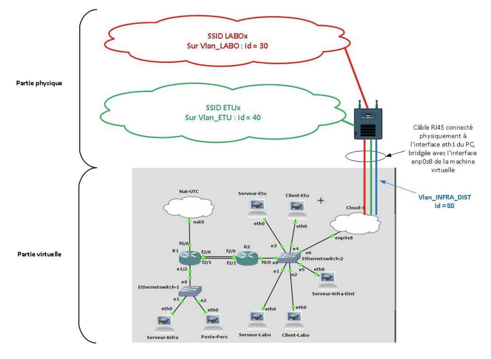

# Projet Architecture

La soutenance de la 1ère partie du projet s’effectuera pendant l’heure de TD de la semaine de 7 et 8 novembre 2018. Le rapport de la 2nde partie devra être rendu le jour même. La maquette devra être opérationnelle et la présentation ne devra pas durer plus de 10 minutes. 

## 1ère partie : 

Il s’agit de l’aboutissement fonctionnel des TDs 1 et 4 du module Architecture.

### Configuration souhaitée : 

#### routeur R1 : 

##### Interface f0/0 : 

  * [ ] adressée en DHCP 
  * [ ] connectée sur l’interface NAT de la machine virtuelle 

##### Interface e1/2 : 

​		Dessert 2 vlans : 

​				* [ ] Vlan_Infra : 

 id=10 

 addresse IP = 10.0.10.1/24 

 Vlan_Pers : 

 id=20 

 addresse IP = 10.0.20.1/24 

 Interface Port-Channel 1 : 

Regroupe 2 membres FastEthernet2/0 et FastEthernet2/1 

o Possède l’adresse IP statique : 10.0.99.1/24 

o Interconnectée à l’interface PortChannel1 du routeur R2 

 Il devra effectuer la translation d’adresse IP pour l’ensemble des machines du réseau (Serveur_Infra, Poste_Pers, Serveur_Labo, Client_Labo, Serveur_Etu, Client_Etu, Serveur_Infra_Pers) Serveur_Infra : 

 connecté à Vlan_Infra 

 addressee en DHCP par le routeur qui lui fournira l’adresse IP : 10.0.10.3/24  fera tourner le service sshd Poste_Pers :  connecté à Vlan_Pers  addressee en DHCP par le routeur qui lui fournira l’adresse IP : 10.0.20.3/24  devra pouvoir accéder au service sshd de Serveur_Infra routeur R2 :  Interface FastEthernet0/0 :