gFichier distribué sous licence Creative Commons [CC-BY-SA](http://creativecommons.org/licenses/by-sa/2.0/)

# Objectif général du projet

L’objectif général du projet est de mettre en place NextCloud, une application Web de stockage et de partage de données, dans un mode le plus redondant possible. Pour cela, nous allons construire :
* un stockage redondant qui assurera à la fois la fonction de NAS (via NFS) et la fonction de SAN (via iSCSI)
* deux serveurs MariaDB en cluster, assurant redondance des données et de leur accès
* deux serveurs d’exécution PHP-FPM, pour la partie applicative
* deux serveurs de présentation NginX, pour la partie présentation, avec une adresse virtuelle VRRP pour la redondance frontale

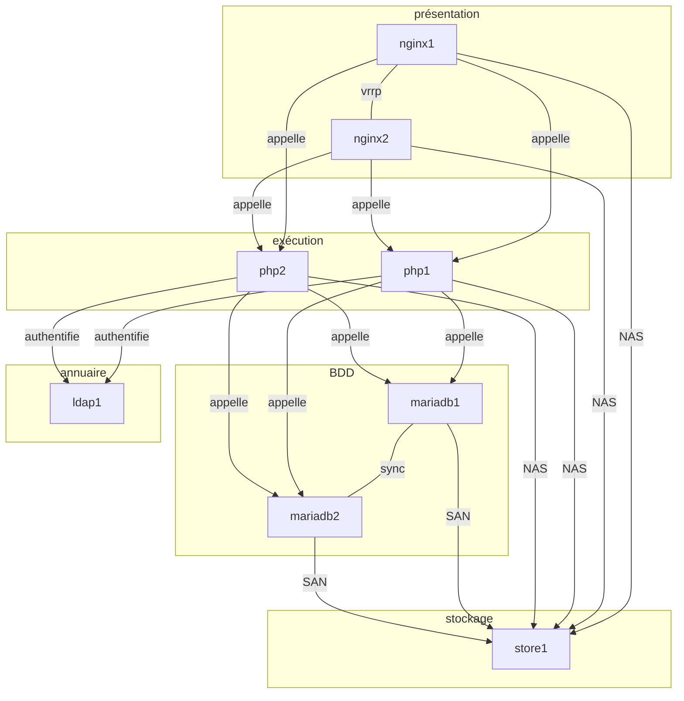

> On ne s’inquiète pas, ça va bien se passer :)

# Construction d’un serveur NAS/SAN avec stockage redondant

## Installation d’une VM Ubuntu Linux Server 18.04

* [x] Nous allons commenmcer par créer une *Golden Image* (une image de machine virtuelle qui nous servira de base pour l’ensemble des VMs créées au cours de ce TD). Pour cela effectuer une installation standard d’Ubuntu Linux Server 18.04 (sans paramètre particulier, pensez simplement à activer le serveur SSH).
* [x] Une fois l’installation terminée, éteignez la machine plutôt que de la redémarrer.
* [x] Redémarrez votre *Golden Image*.
* [x] Remplacez la ligne suivante dans `/etc/cloud/cloud.cfg` :

```
preserve_hostname: false
```

Par :

```
preserve_hostname: true
```

> Le fichier `/etc/cloud/cloud.cfg` est une particularité d’Ubuntu 18.04 Server.

* [x] Supprimez les fichiers `/etc/ssh/ssh_host*` :

```
# rm -f /etc/ssh/ssh_host*
```

**Vous pouvez éteindre votre machine. Dans l’interface de Proxmox, vous pouvez la transformer en *template*.**

À chaque fois que vous clonez cette machine à partir du *template*, vous devrez :
* éditer le nom de la machine dans le fichier `/etc/hostname`
* lancer la commande de reconfiguration de SSH `dpkg-reconfigure openssh-server`
* redémarrer

> À partir de ce moment, vous pourrez prendre la main en SSH sur la machine virtuelle avec l’utilisateur par défaut.

## Premier clone

Effectuez votre premier clone. Cette machine servira de stockage partagé pour l’ensemble des autres machines. Associez 3 disques de taille égale (environ 10Gio).

## Systèmes redondants de données: RAID

Objectif de cette partie :

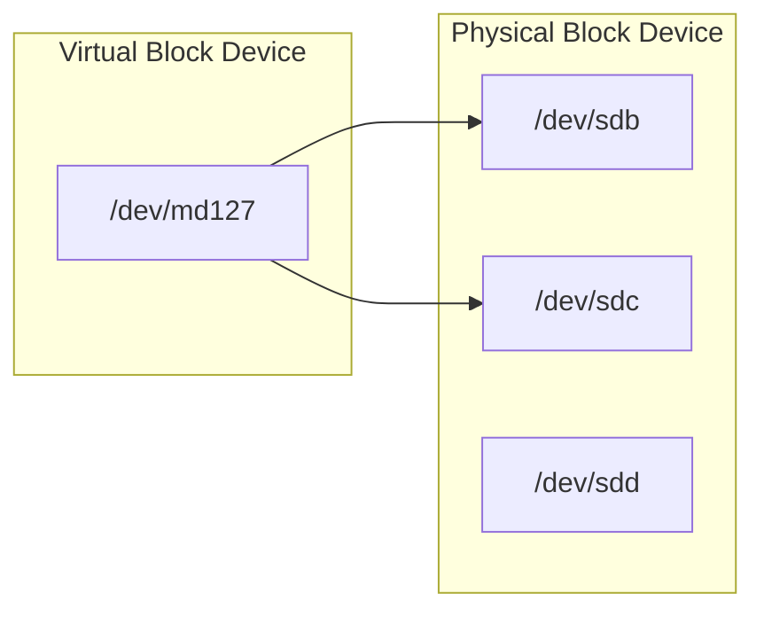

### Création d’un RAID1 logiciel

> Vous pouvez vérifier les partitions/disques à votre disposition avec la commande `lsblk`

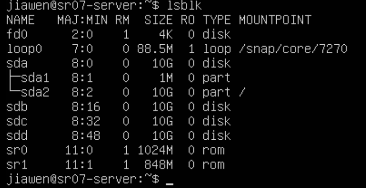

* [x]  Construire un block device virtuel

  Vous allez créer un array en RAID1 à partir de deux disques virtuelles. À partir des deux block devices physiques disponibles (`/dev/sdb` et `/dev/sdc`), vous allez pouvoir construire un block device virtuel grâce à la commande `mdadm` (`/dev/md127` dans notre cas) :

```
# mdadm --create /dev/md127 --level=1 --raid-devices=2 /dev/sdb /dev/sdc
```

​	`--level` permet de spécifier le type de RAID que vous souhaitez (0, 1, 5, 10, etc…). `--raid-devices` précise le nombre de partitions ou block devices physiques concernés par ce RAID. L’ordre dans lequel vous listez les partitions va déterminer quelle partition sera considérée comme maître.

Vous pouvez constater la progression de la construction (ou de la reconstruction) du RAID via le fichier `/proc/mdstat`.

```
# cat /proc/mdstat
Personalities : [raid1]
md127 : active raid1 sdc[1] sdb[0]
      38981632 blocks [2/2] [UU]
unused devices: <none>
```

`[0]` indique le volume maître. `[2/2]` indique le nombre de disques online pour cet array et `[UU]` les disques online.

> Que se passe-t-il maintenant quand le système veut écrire sur le block device virtuel `/dev/md127` ?

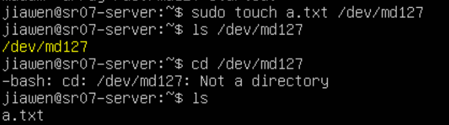

Il semble qu'on ne peut pas créer des fichiers dans ce dossier.

### Mise en défaut du RAID

Pour l’instant, votre RAID1 se porte bien. Voyons ce qui se produit si nous le titillons un peu…

* [x] Commencez par formater le block device `/dev/md127` que vous avez créé en `ext4` :

```shell
mkfs.ext4 /dev/md127
```

* [x] Remarquez au passage qu’il est vu comme une simple block device. Montez la partition dans `/mnt` et placez quelques fichiers dedans.

  ```shell
  mkdir /mount/raid1
  sudo mount /dev/md127 /mnt/raid1
  ```

* [x] Vérifiez l’état de votre RAID :

```
# mdadm --detail /dev/md127
```

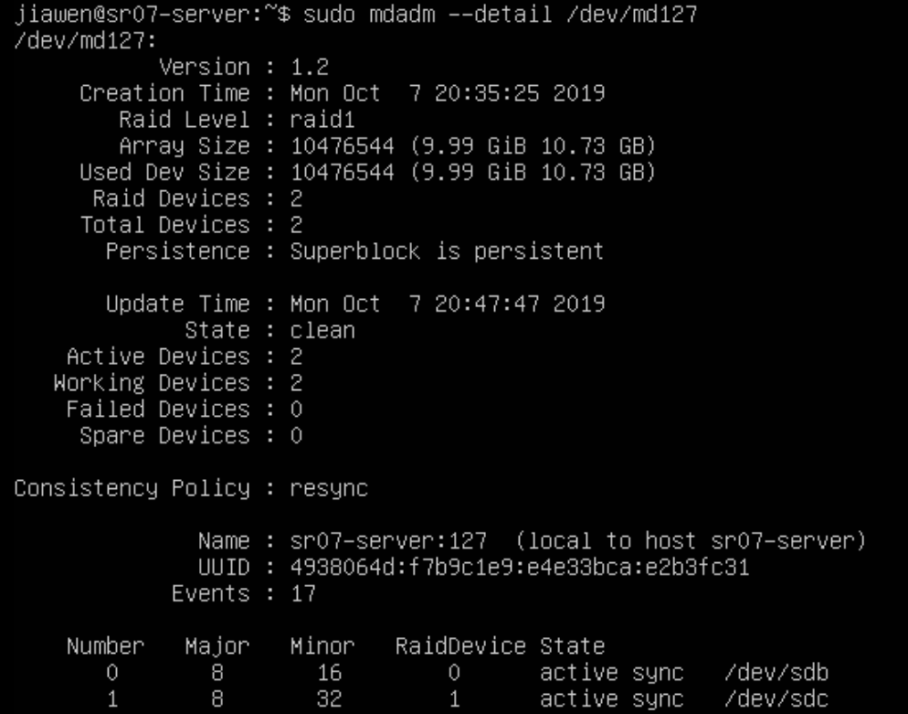

* [x] Maintenant, nous allons artificiellement déclarer un des block devices composant le RAID comme défectueux :

```shell
mdadm --manage /dev/md127 --fail /dev/sdc
# mdadm: set /dev/sdc faulty in /dev/md127
```

* [x] Vous pouvez maintenant constater, dans le fichier `/proc/mdstat` que votre RAID fonctionne en mode dégradé.

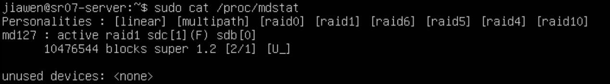

> Pouvez-vous toujours accéder à vos données ? Vos fichiers ont-ils été endommagés ?

* [x] Enlevez le volume défaillant du groupe RAID :

```shell
mdadm --manage /dev/md127 --remove /dev/sdc
# mdadm: hot removed /dev/sdc
```

* [x] Jetez un œil dans `/proc/mdstat` pour constater que le volume est à présent marqué comme manquant. Vous pouvez de nouveau l’ajouter au groupe RAID et constater que ce dernier va se reconstruire tout seul :

  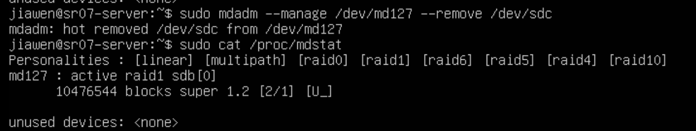

```
# mdadm --manage /dev/md127 --add /dev/sdc
mdadm: re-added /dev/sdc
```

Évidemment, pour l’utilisateur, la défaillance du disque, sa suppression du groupe RAID et l’ajout d’un « nouveau » disque ont été complètement transparents.

> Que se passe-t-il si le maître est marqué comme défaillant au moment de la reconstruction du RAID ?
>
> 如果在重建RAID时将主服务器标记为有故障，该怎么办？


## Gestionnaire de volumes logiques : LVM

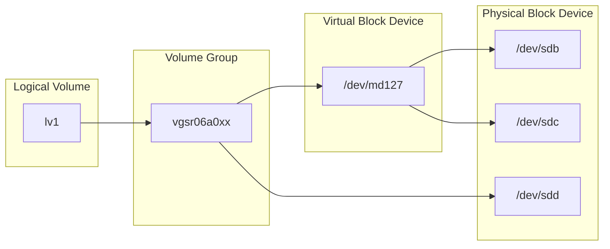

> Note : `lv1` va du coup être aussi un block device virtuel

### Création d’un Volume Group

* [x] Démontez `/dev/md127` de votre arborescence.

  ```shell
  sudo umount /dev/md127
  ```

* [x] Créez un Physical Volume sur ce le dernier disque de la machine :

```
# pvcreate /dev/sdd
```

* [x] Le volume physique est à présent initialisé correctement. Créez un groupe de volumes :

```
# vgcreate vgsr06a0xx /dev/sdd
```

Le VG est à présent prêt pour recevoir des volumes logiques. Contrôlez le nombre de physical extents disponibles dans votre VG :

```
# vgdisplay
  --- Volume group ---
  VG Name               vgsr06a0xx
  System ID
  Format                lvm2
  [...]
  VG Size               672,00MB
  PE Size               32,00 MB
  Total PE              21
  Alloc PE / Size       0 / 0,00 MB
  Free  PE / Size       21 / 672,00 MB
  VG UUID               Dngwte-RuVl-CdqX-fEAG-2YE9-BdiS-EE12x6
```

* [x] Créez en conséquence un LV :

```
# lvcreate --size 2G --name lvtest vgsr06a0xx
```

Créez un système de fichiers dans ce LV et montez-le dans votre arborescence (dans `/mnt` par exemple).

```shell
sudo mkfs.ext4 /dev/vgsr07/lvtest
sudo mkdir /mnt/lvm
sudo mount /dev/vgsr07/lvtest /mnt/lvm
```

> Quel est le type du fichier /dev/<volume_group>/<logical_volume> ?

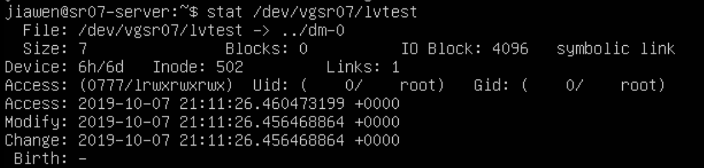

symbolic link

### Agrandissement du Volume Group

Comme illustration de la grande force de LVM, nous allons agrandir la taille du groupe de volumes, du volume logique puis du système de fichiers que nous venons de créer.

* [x] On commence par créer un nouveau PV à partir de la partition RAID de la partie I. :

```
# pvcreate /dev/md127
```

* [x] On étend le groupe de volumes avec ce nouveau PV :

```
# vgextend vgsr06a0xx /dev/md127
```

Vous pouvez constater à l’aide de `pvs`, `vgs`, `pvdisplay` et `vgdisplay` que votre groupe de volumes dispose maintenant de plus d’extents… dont nous allons faire profiter le seul LV qui l’occupe.

* [x] Étendez le LV (ne prenez que quelques extents, juste de quoi dépasser la taille du RAID d’origine) :

```
# lvextend --size +15G /dev/vgsr06a0xx/lvtest
```

* [x] À présent, redimensionnez votre système de fichiers pour le faire correspondre à la taille du LV :

```
# resize2fs /dev/vgsr06a0xx/lvtest
```

> Que constatez-vous au niveau du volume logique monté ? Y a-t-il eu interruption de service ? Est-ce qu’une opération de ce type est possible avec des partitions standards ?
> Est-ce que la même opération est possible pour réduire un volume logique ? Quelles précautions faut-il prendre ?

​	Il n'y a pas d'interruption de service, 

​	Avec des partitions standards, c'est pas possible, parce qu'il faut faire `umount` du device.

​	Pour réduire un volume logique, est-ce que l'on doit 

​	il faut de faire une migration des données dans la partie que l'on veut réduire

```shell
pvmove <olddev> <destination>
```


### Manipulation de snapshots

* [x] Placez quelques fichiers sur le volume logique monté que vous venez d’agrandir. Vérifiez qu’il vous reste de la place dans le groupe de volume correspondant. Créez un volume de snapshot à partir du volume montée :

```shell
cp -r /etc /mnt/lvm
lvcreate --snapshot --extents 200 --name lvtest_snap /dev/vgsr06a0xx/lvtest
```

* [x] Regardez le statut des volumes logiques :

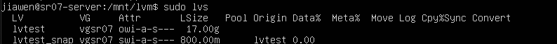

```
# lvs
  LV        VG   Attr   LSize  Origin Snap%  Move Log Copy%  Convert
  lvtest    test owi-ao  1,83G
  test_snap test swi-a- 40,00M lvtest   0,00
```

* [x] Supprimez des fichiers du volume logique monté. Vérifiez de nouveau le statut des volumes logiques. Essayez de monter en lecture seule le volume de snapshot(read only).

  ```shell
  sudo rm -rf ./etc
  ```

  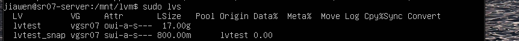

  nothing happened...

  ```shell
  sudo mkdir /mnt/lvtest-snap
  sudo mount -o ro /dev/vgsr07/lvtest_snap /mnt/lvtest-snap
  ```

> Que constatez-vous quant à la taille du snapshot une fois les fichiers supprimés ? Quel est le contenu du snapshot que vous avez monté ?

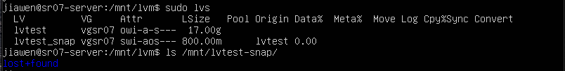

Essayez de faire un autre snapshot et faites quelques manipulations de fichiers supplémentaires.

> Que pensez-vous des performances disque d’un tel système ? Est-il possible de l’utiliser dans des conditions de production ? Sous quelles réserves ?

​	La vitesse de I/O est influencée 

​	Dans le cas que l'utilisateur a envie de faire une sauvegarde de la base de données

Montez une des partitions de snapshot en écriture (option rw sur mount). Modifiez un fichier.

> Est-ce que le fichier d’origine a été modifié ? Que pouvez-vous envisager de faire grâce à ce genre de manipulation ?

## Partage NAS avec NFS

* [x] Avant de procéder, nous allons supprimer le disque `/dev/sdd` du volume group que vous avez créé et détruire le logical volume lvtest :

```
# lvremove /dev/vgsr06a0xx/lvtest_snap
# lvremove /dev/vgsr06a0xx/lvtest
# vgreduce vgsr06a0xx /dev/sdd
```

* [x] Éteignez votre machine, sortez le disque de la configuration et redémarrez.

### Configuration du serveur NFS

* [x] Ensuite, installez les paquets nécessaires pour transformer votre machine en serveur NFS :

```shell
sudo vim /etc/apt/apt.conf.d/90....
#然后删除所有的设置
apt install nfs-kernel-server
```

* [x] Créez un logical volume (2Gio devrait suffire), formatez-le, montez-le dans `/srv` et ajoutez-le dans `/etc/fstab`.

  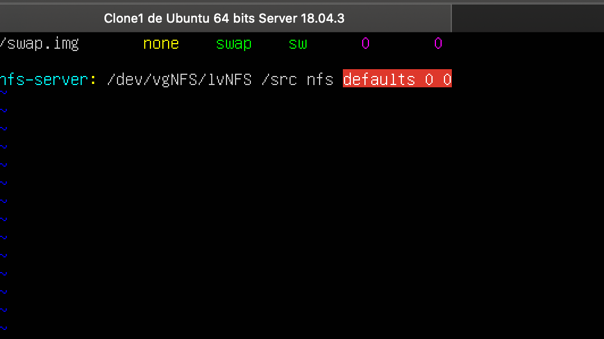

* [x] Éditez le fichier `/etc/exports` avec une ligne de ce style :为了共享

```
/srv	<@ip_serveur>/24(rw,sync,no_subtree_check)
```

* [x] Redémarrez le service `nfs-server` pour rendre la configuration effective.

### Configuration d’un client NFS

#### TL;DR

1. 装包
2. 往磁盘里装东西
3. 写文件共享磁盘

* [x] Clonez de nouveau votre machine de base et démarrez-la. Nous allons nous en servir comme client NFS et vérifier que tout fonctionne correctement. Installez les paquets NFS client :

```
# apt install nfs-common
```

* [x] Vous pouvez ensuite constater que le partage est effectif :

  @ip_serveur:172.16.210.131/24

```
# showmount -e <ip du serveur>
```

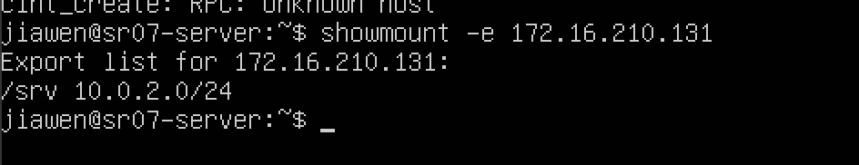

* [x] Montez-le dans le répertoire `/mnt` :

```
mount -t nfs <ip du serveur>:/srv /mnt
```

> Pouvez-vous écrire des fichiers sur ce montage ? Pourquoi ?

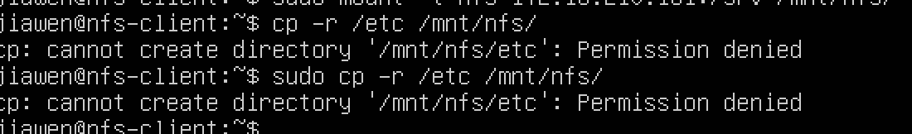

Non,je ne peux pas.

### Configuration avancée

Nous allons créer un dossier `test` du côté du serveur NFS qui sera accessible à l’utilisateur ayant l’UID 1000 (le premier utilisateur du système dans la configuration actuelle).

Sur le serveur, créez un répertoire dans `/srv` (le point de montage du serveur NFS) et donnez-lui les bonnes autorisations.

> Peut-on alors écrire des données dans l’utilisateur 1000 depuis le client ? Que constatez-vous côté serveur NFS ?

Nous allons tester la persistence du montage. Éditez le fichier `/etc/fstab` sur le client et ajoutez la ligne suivante :

```
<ip du serveur>:/srv	/srv	nfs	users,noauto,x-systemd.automount,x-systemd.device-timeout=10	0	0
```

Redémarrez et vérifiez que le client NFS se déclenche lorsque vous essayez d’accéder au dossier `/srv`.

> Vous pouvez créer un dossier `/srv/http` et lui attribuer les droits de l’UID 33 (utilisateur `www-data` sur tous les systèmes que nous allons installer).

## Configuration iSCSI

Nous allons maintenant configurer une target iSCSI sur notre serveur de stockage et le tester.

Commencez par installer `tgt` :

```
# apt install tgt
```

### Configuration des volumes et de la target

Créez deux logical volumes LVM sur votre VG, d’environ 2Gio chacun. Notez qu’il ne faut pas les formater.

Créez deux fichiers de configuration sous `/etc/tgt/conf.d` terminant en `.conf` et ressemblant à ceci (à adapter à votre cas) :

```
<target iqn.2018-10.sr06a0xx.utc:tg1-lv1> # ceci est le World Wide Name de la target
	backing-store /dev/vgsr60a0xx/iscsi_lv1 # ceci est le block device que vous partagez en SAN
	incominguser store1 SuperMotDePasse # ceci est le nom d’utilisateur/mot de passe pour identifier le client
</target>
```

Redémarrez `tgt` pour prendre en compte les changements :

```
# systemctl restart tgt.service
```

Vous pouvez voir l’état de `tgt` avec la commande suivante :

```
# tgtadm --mode target --op show
```

Vous devriez voir vos deux volumes exportés en SAN.

### Test de configuration d’un client

Sur la machine de test, installez `open-iscsi` :

```
# apt install open-iscsi
```

Vous devez ensuite découvrir la target et vous connectez dessus. Pour cela :

```
# iscsiadm -m discovery -t st -p <adresse IP de la target>
<adresse IP de la target>:3260,1 iqn.2018-09.sr06a0xx.utc:tg1-lv1
<adresse IP de la target>:3260,1 iqn.2018-09.sr06a0xx.utc:tg1-lv2
```

Cette découverte va automatiquement créer des fichiers de configuration dans `/etc/iscsi/send_targets`. Trouvez le fichier `default` correspondant à votre première LUN iSCSI sur votre target et remplacez les lignes :

```
node.startup = manual
[…]
node.session.auth.authmethod = None
```

Par :

```
node.startup = automatic
node.session.auth.authmethod = CHAP
```

Ajoutez ensuite les lignes correspondants au login/pass défini plus haut :

```
node.session.auth.username = store1
node.session.auth.password = SuperMotDePasse
```

Vous pouvez alors vous loggez sur la LUN de la target via la commande suivante :

```
# iscsiadm -m node --targetname iqn.2018-09.sr06a0xx.utc:tg1-lv1 -l
```

Logiquement, vous devriez voir apparaître un nouveau disque `/dev/sdb` si vous utilisez la commande `lsblk`. Vous pouvez le formater en `ext4` ou autres et le monter dans `/srv` (inutile de créer une partition dessus). Remarquez bien que vous avez créé ce système de fichiers **côté initiator** (client) et que le target (serveur) n’a donc absolument aucune idée de ce que vous êtes en train de faire.

Éditez le fichier `/etc/fstab` pour rendre le changement persistent au démarrage et redémarrez pour vérifier (supprimez votre point de montage NFS au passage) :

```
/dev/sdb	/srv	ext4	defaults,auto,_netdev	0	0
```

Si tout fonctionne correctement, vous pouvez supprimer complètement cette machine de test. Lors de l’installation de NextCloud, les machines frontales (présentation avec NginX et exécution avec PHP-FPM) auront besoin d’accéder au NAS héberger sur la machine de stockage. Les deux machines virtuelles constituant le cluster de base de données accèderont chacune à une LUN exporté en mode SAN par cette même machine.

# Serveur LDAP

## LDAP

* DN —— 一条LDAP的一句
* DC —— 一般为公司名
* OU —— 组织单位，什么什么部或者什么什么组
* CN —— 服务器名或者用户名

Clonez votre machine de base et faites les réglages nécessaires dessus (`/etc/hostname`, configuration SSH, etc…).

* [x] Installez OpenLDAP :

```
# apt install slapd ldap-utils
```

* [x] Après l’installation, utilisez l’utilitaire de configuration de paquet pour créer la racine de votre annuaire LDAP ainsi que le compte administrateur de l’annuaire :

```
dpkg-reconfigure slapd
```

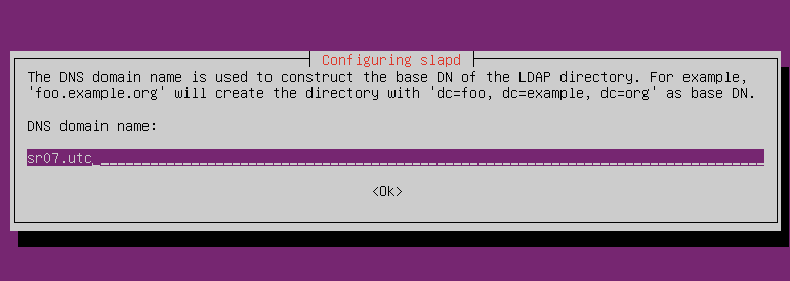

* [x] L’utilitaire vous guidera dans la création de votre annuaire. Donnez à votre racine un nom de type :

  Au début:

  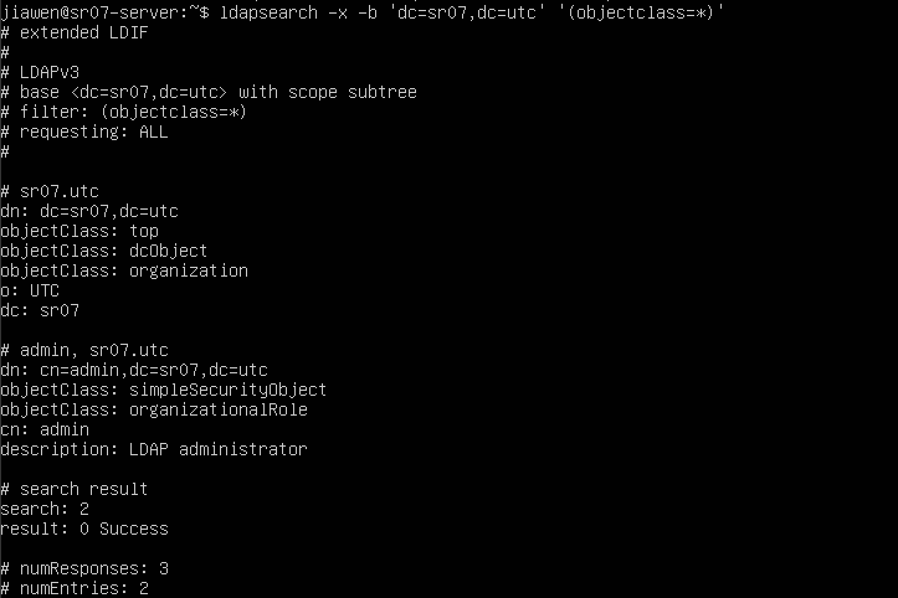

```
dc=<nom-du-groupe>,dc=utc
```

### Création des Organizational Units

Notre arbre va avoir la représentation suivante :

```mermaid
graph TD
dc=utc --> dc=sr06a0xx
dc=sr06a0xx --> ou=Users
dc=sr06a0xx --> ou=Groups
```

* [x] Commencez par créer un fichier LDIF et ajoutez-y les informations suivantes :

```
dn: ou=Users,dc=<nom-du-groupe>,dc=utc
objectclass: organizationalUnit
ou: Users
```

* [x] Vous venez de définir une Organizational Unit ou OU. Ajoutez ces informations au LDAP avec la commande `ldapadd` :

```bash
$ ldapadd -x -D 'cn=admin,dc=<nom-du-groupe>,dc=utc' -W -f init.ldif
#-x use simple authentication
#-D Use the disinguished Name(DN) to bind to the LDAP
#-W Prompt for simple authentication
#-f Read the entry modification from file instead of from standard input
```

> -x précise que l’on utilise pas de connexion sécurisée (en temps normal, il faudrait utiliser une connexion chiffrée mais ce n’est pas le but de l’exercice) et il faudra donc le mettre systématiquement. -D permet de se *binder* au LDAP en tant qu’utilisateur `admin`.

```bash
$ ldapmodify -x -D 'cn=admin,dc=<nom-du-groupe>,dc=utc' -W -f init.ldif
#增加新条目需要写在文件开头，并加上changetype: add
```

* [x] Vous devriez normalement pouvoir voir le contenu du LDAP :

```bash
ldapsearch -x -b 'dc=<nom-du-groupe>,dc=utc' '(objectclass=*)'
```

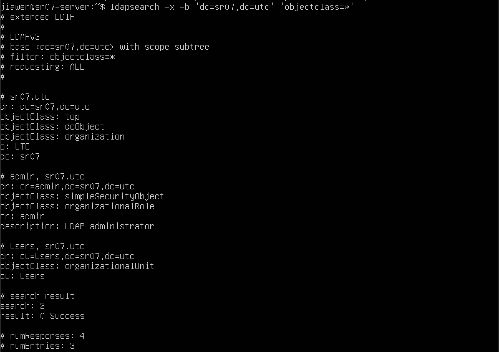

Sur le même principe, vous allez créer l’OU Groups qui contiendra les groupes d’utilisateurs, sur le même modèle que précédemment.

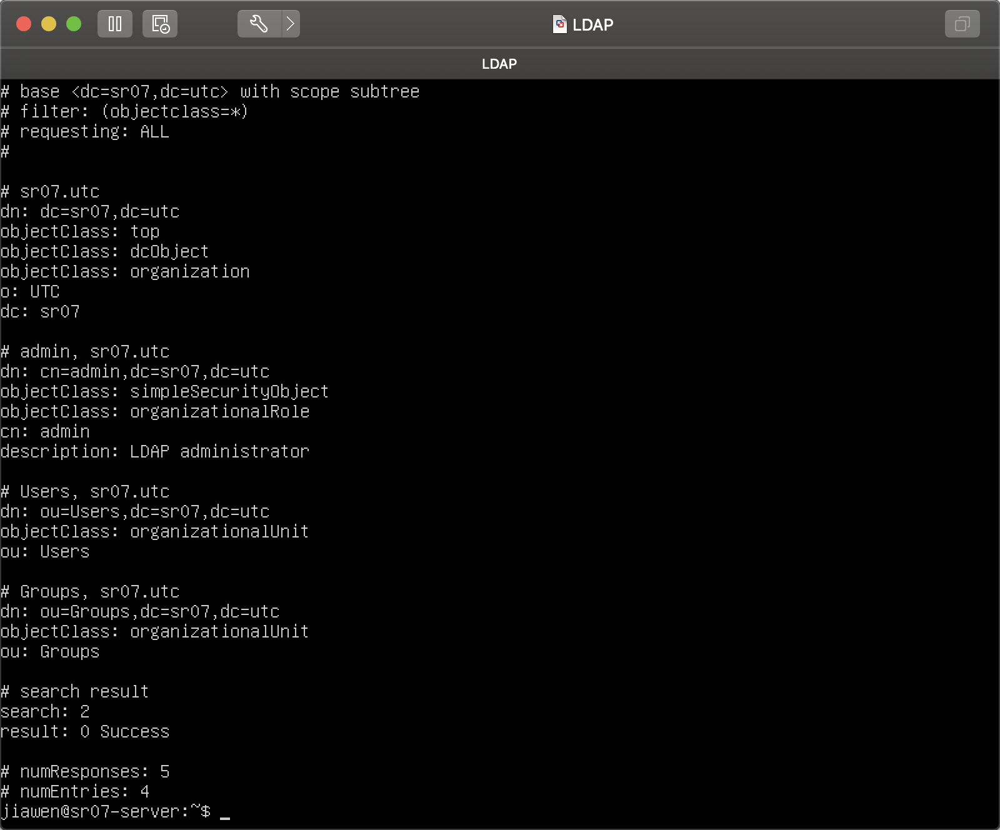

### Création d’un carnet minimal d’utilisateurs

* [x] Vous pouvez créer des utilisateurs dans le LDAP avec la commande `ldapadd(1)` et quelques fichiers LDIF. Voici un exemple d’utilisateur et de groupe :

```
dn: uid=cveret,ou=Users,dc=<nom-du-groupe>,dc=utc
uid: cveret
cn: Clément VÉRET
objectClass: account
objectClass: posixAccount
objectClass: top
objectClass: shadowAccount
userPassword: {SSHA}<hash de mot de passe>
loginShell: /bin/bash
uidNumber: 600
gidNumber: 10000
homeDirectory: /home/cveret
```

> Vous pouvez facilement obtenir un hash de mot de passe à l’aide de la commande `slappasswd`.

```bash
slappasswd -s <passwd>
```


* [x] Créez le groupe primaire de cet utilisateur, ainsi qu’un groupe secondaire :

```ldif
dn: cn=groupe_td,ou=Groups,dc=<nom-du-groupe>,dc=utc
objectClass: posixGroup
objectClass: top
cn: groupe_td
gidNumber: 10000

dn: cn=groupe_secondaire,ou=Groups,dc=<nom-du-groupe>,dc=utc
objectClass: posixGroup
objectClass: top
cn: groupe_secondaire
gidNumber: 10001
memberUid: cveret
```

* [x] Après les avoir ajoutés, vérifiez à l’aide de `ldapsearch` que les utilisateurs et groupes sont correctement définis.

`jiawen.ldif`

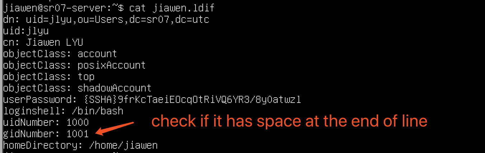

`group-jiawen.ldif`

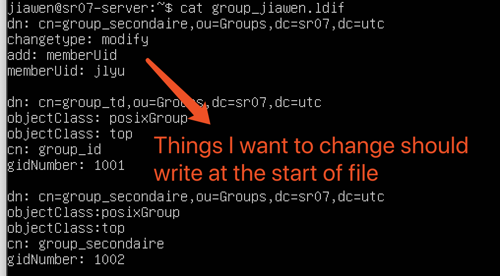

Lance `ldapsearch`

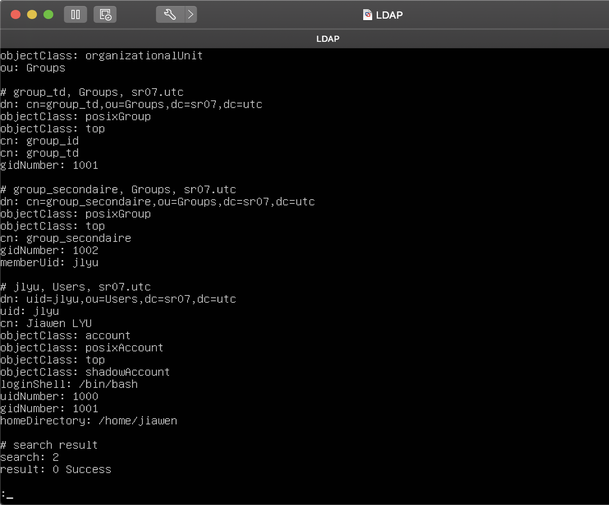

* [ ] Créez quelques utilisateurs supplémentaires sur le même modèle.

* [ ] Vérifiez également que les mots de passe sont correctement définis : utilisez l’un des utilisateurs créés au lieu de l’utilisateur admin pour vous binder au LDAP lors de vos recherches.

# Cluster MariaDB

Clonez deux machines supplémentaires. Modifiez leur paramétrage correctement. Formatez et montez un volume iSCSI distant sur chaque machine dans `/var/lib/mysql`.

## Installation de MariaDB et paramétrage de Galera Cluster

Activez les dépôts `universe` sur la machine en ajoutant le mot clé correspondant dans `/etc/apt/sources.list` (juste après le mot-clé `main`). Installez MariaDB sur chacune des machines :

```
# apt update && apt install mariadb-server
```

Créez un fichier `/etc/mysql/mariadb.conf.d/galera.cnf` avec le contenu suivant sur le nœud 1 du cluster :

```
[mysqld]
binlog_format=ROW
wsrep_provider=/usr/lib/libgalera_smm.so
wsrep_cluster_name="cluster_sr06"
wsrep_cluster_address="gcomm://"
wsrep_sst_method=rsync
wsrep_on=ON
wsrep_node_address="<adresse IP nœud 1>"
wsrep_node_name="node1"
```

Cette configuration va permettre d’initialiser le nœud MariaDB du cluster Galera. Arrêtez le service `mariadb` et lancez la commande suivante :

```
# galera_new_cluster
```

Relancez le service `mariadb`. Le premier nœud est initialisé. Sur le second nœud, créez également un fichier `/etc/mysql/mariadb.conf.d/galera.cnf` similaire au premier. Changez simplement l’adresse du nœud et indiquez cette fois-ci l’adresse du cluster Galera :

```
wsrep_cluster_address="gcomm://<adresse IP nœud 1>,<adresse IP nœud 2>"
```

Redémarrez le service `mariadb` sur le second nœud. Revenez sur le premier nœud et indiquez de nouveau l’adresse complète du cluster (comme ci-dessus).

À partir de maintenant, **les deux nœuds sont synchrones**. Il faut donc impérativement que l’un soit démarré pour que l’autre puisse démarrer (pour récupérer le log binaire des dernières transactions). Si vous devez redémarrer le cluster au complet, il faut impérativement retoucher la commande `wsrep_cluster_address` sur le premier nœud à démarrer avant de démarrer le second, puis remettre la valeur d’origine.

## Initialisation de la base de données MariaDB

Sur le nœud 1, lancez le script d’initialisation de la base et suivez les instructions :

```
# mysql_secure_installation
```

Connectez-vous au premier nœud du cluster et créez une base `nextcloud` et un utilisateur associé :

```
# mysql -u root
MariaDB [(none)]> CREATE DATABASE nextcloud;
MariaDB [(none)]> GRANT ALL PRIVILEGES ON nextcloud.* TO ncuser IDENTIFIED BY 'super_mot_de_passe';
```

Vérifiez sur le second nœud que vous pouvez bien vous connecter en tant qu’utilisateur `ncuser` et que vous voyez la base de données :

```
# mysql -u ncuser -psuper_mot_de_passe
MariaDB [(none)]> SHOW DATABASES;
```

Si c’est le cas, votre cluster MariaDB est bien synchrone.

> Lors de la configuration de votre instance NextCloud, vous ne pourrez préciser qu’une seule adresse IP pour le cluster MariaDB. Il est possible de prendre en compte les deux, mais cela exige une configuration plus avancée qui sort du cadre de ce TD.

Pour terminer la configuration, assurez-vous que MariaDB écoute bien sur toutes les interfaces réseaux (et toutes les adresses) en commentant la ligne ci-dessous dans le fichier `/etc/mysql/mariadb.conf.d/50-server.cnf` :

```
bind-address = 127.0.0.1
```

# NginX, PHP-FPM et VRRP

Clonez deux fois votre image de base. Ces deux machines seront nos frontaux de présentation Web.

Les deux frontaux NginX auront également besoin d’accéder à votre partage NAS pour y servir les fichiers qui y sont stockés (prenez le répertoire `/srv` par exemple).

## Installation et paramétrage de Keepalived

Keepalived permet de faire du VRRP (*Virtual Router Redundancy Protocol*) : une adresse IPv4 ou IPv6 virtuelle est présente sur la machine principale. Si cette dernière n’est plus joignable ou défaillante, l’adresse sera reprise automatiquement par une autre machine, garantissant ainsi la continuité de service.

Pour simplifier, nous n’allons faire de redondance que sur une adresse IPv4, mais c’est applicable de la même manière à un groupe d’adresses hétérogènes.

Installez Keepalived :

```
# apt install keepalived
```

### Paramétrage du maître VRRP

Nous allons maintenant créer une adresse IP virtuelle sur l’un des deux serveurs.

Les adresses IPv4 ou IPv6 virtuelles dans VRRP sont systématiquement associées à une interface réseau et à un numéro (le VRID, Virtual Router ID). Chaque machine faisant du VRRP fait une annonce en broadcast sur son segment réseau à intervalle régulier pour signaler qu’elle est vivante et est capable de prendre en charge un VRID (et donc une ou plusieurs adresses IP associées). Cela permet d’avoir plusieurs communautés VRRP dans le même segment réseau.

Chaque VRID est ensuite regroupé dans un groupe VRRP. En cas de défaillance d’une interface dans le groupe, l’ensemble des adresses IP dans le VRID associé bascule sur une autre machine.

**Comme toutes vos machines virtuelles sont dans le même segment réseau, prenez votre numéro de groupe comme *VRID* et choisissez une adresse reprenant aussi votre numéro de groupe.**

Pour notre cas, nous n’allons avoir qu’un seul groupe avec un seul VRID contenant une seule adresse pour une seule interface. Créez le fichier `/etc/keepalived/keepalived.conf` sur la machine maître avec le contenu suivant :

```
vrrp_sync_group VRRP_GRP1 {
	group {
		VIP_ETH
	}
}

vrrp_instance VIP_ETH {
	# State = Master ou Backup
	state MASTER
	# l’interface qui servira pour les annonces VRRP
	interface ens18
	# VRID
	virtual_router_id 10
	# la priorité de ce nœud VRRP dans le groupement
	priority 100
	version 3
	virtual_ipaddress {
		192.168.56.200
	}
}
```

> Choisissez bien soigneusement l’adresse de redondance de sorte à ce qu’elle ne puisse pas être en conflit avec d’autres adresses (choisissez-la hors de la plage DHCP de préférence)

La configuration du serveur secondaire se fait exactement de la même manière à deux détails près : `state` doit être réglé sur `BACKUP` et `priority` doit être amené à un nombre inférieur.

Une fois cette configuration faite, redémarrez le service `keepalived` vérifiez que vous pouvez joindre cette adresse depuis la machine hôte (avec `ping` par exemple). Vous pouvez également observer l’adresse secondaire sur l’interface configurée :

```
$ ip -4 address show dev ens18
2: ens18: <BROADCAST,MULTICAST,UP,LOWER_UP> mtu 1500 qdisc pfifo_fast state UP group default qlen 1000
	inet 192.168.56.101/24 brd 192.168.56.255 scope global eth0
		valid_lft forever preferred_lft forever
	inet 192.168.56.200/32 scope global secondary eth0
		valid_lft forever preferred_lft forever
```

> Que se passe-t-il si vous éteignez la machine maître ? Combien de temps faut-il pour que la bascule soit effective ?

## Installation et paramétrage de NginX

Installez NginX :

```
# apt install nginx
```

NextCloud ne peut plus fonctionner sans HTTPS. Nous allons donc créer un certificat auto-signé pour permettre à votre configuration de NginX de fonctionner correctement.

```
$ openssl req -x509 -newkey rsa:4096 -sha256 -nodes -keyout nextcloud.key -out nextcloud.crt -days 365
```

Vous pouvez ensuite récupérer un fichier de configuration (à adapter) dans la [documentation officiel de NextCloud](https://docs.nextcloud.com/server/14/admin_manual/installation/nginx.html). Vous pouvez supprimer le contenu de `/etc/nginx/sites-available/default` pour pouvoir y injecter ces informations.

Il sera nécessaire d’y faire les adaptations suivantes :
* chemin des certificats SSL (mot-clé `ssl_certificate` et `ssl_certificate_key`)
* URI du site (mot-clé `server_name`) que vous pouvez initialiser à une valeur quelconque (`nextcloud.utc` par exemple)
* adresse IP des serveurs d’exécution PHP (section `upstream`)
* chemin d’accès à NextCloud (dans votre partage NAS en `/srv/http/nextcloud` par exemple, mot-clé `root`)

Redémarrez le service `nginx` pour prendre en compte les modifications.

Pour pouvoir accéder à votre NextCloud depuis votre machine hôte, vous devrez ajouter l’adresse VRRP et l’URI du site choisi dans le fichier `/etc/hosts` sur l’hôte.

> C’est normalement une **TRÈS TRÈS** mauvaise pratique, mais pour les besoins du TD, nous passerons outre.

À ce stade et même sans avoir installé NextCloud, vous devriez être en capacité d’accéder à votre site Web (qui fera une magnifique erreur 502…). Reproduisez la même configuration sur le second frontal NginX (pensez simplement à recopier le certificat plutôt que de le regénérer).

## Installation et paramétrage de PHP-FPM

Clonez deux machines supplémentaires. Ces deux machines devront également accéder au NAS avec le même chemin d’accès que les frontaux Web.

Comme pour MariaDB, ajoutez les dépôts `universe` sur ces deux machines.

Installez ensuite PHP-FPM et les quelques modules PHP indispensables pour le bon fonctionnement de NextCloud :

```
# apt install php-fpm php-gd php-ldap php-mbstring php-mysql php-xml php-curl php-zip
```

Éditez le fichier `/etc/php/7.2/fpm/pool.d/www.conf` et remplacez la ligne suivante :

```
listen = /run/php/php7.2-fpm.sock
```

Par :

```
listen = 9000
```

Redémarrez le service `php7.2-fpm` pour prendre en compte la modification. Logiquement, votre serveur d’exécution PHP devrait écouter sur le port 9000. Vous pouvez le vérifier avec la commande suivante :

```
# ss -lpn | grep -i 9000
tcp  LISTEN 0      128    *:9000         *:*       users:(("php-fpm7.2",pid=10751,fd=9),("php-fpm7.2",pid=10748,fd=9),("php-fpm7.2",pid=10727,fd=7))
```

Vous pouvez alors reproduire cette configuration sur l’autre machine.

[Téléchargez la dernière version de NextCloud Server](https://nextcloud.com/install/#instructions-server), décompressez-la dans le répertoire NAS monté sur l’une des machines NginX ou PHP-FPM. Paramétrez correctement les droits du répertoire (accessible en lecture/écriture pour l’utilisateur `www-data`). Assurez-vous qu’il est bien accessible par le même chemin sur les machines de présentation et d’exécution.

> Étant donné la façon dont fonctionne les droits d’accès, je vous recommande de le faire sur le NAS directement et d’y positionner les droits d’accès. Vous aurez besoin du logiciel `unzip` pour décompresser l’archive.

# Vos objectifs pour le projet

Pour le projet :
* vous devez paramétrer votre instance NextCloud pour que sa base de données soit stockée sur votre instance redondée MariaDB (prenez l’une ou l’autre des IP de votre cluster MariaDB)
* vous devez paramétrer le module LDAP de votre instance NextCloud pour aller chercher vos utilisateurs et vos groupes sur l’annuaire LDAP que vous avez paramétré ([encore une fois, la doc est là pour vous aider](https://docs.nextcloud.com/server/14/admin_manual/configuration_user/user_auth_ldap.html))
* lors du paramétrage LDAP, vous devrez préciser les classes d’objets correspondants à vos utilisateurs et groupes dans votre annuaire. Pour notre cas, la requête LDAP sera la suivante pour les utilisateurs :

```
(|(objetClass=posixAccount))
```
Et la suivante pour les groupes :

```
(|(objectClass=posixGroup))
```
* afin de montrer que tout cela fonctionne, vous devrez créer 3 utilisateurs dans NextCloud (A, B, C), puis créer un partage de l’utilisateur A vers les utilisateurs B et C. Lorsqu’un des utilisateurs se connectent, il doit être en capacité de voir le partage en question.
